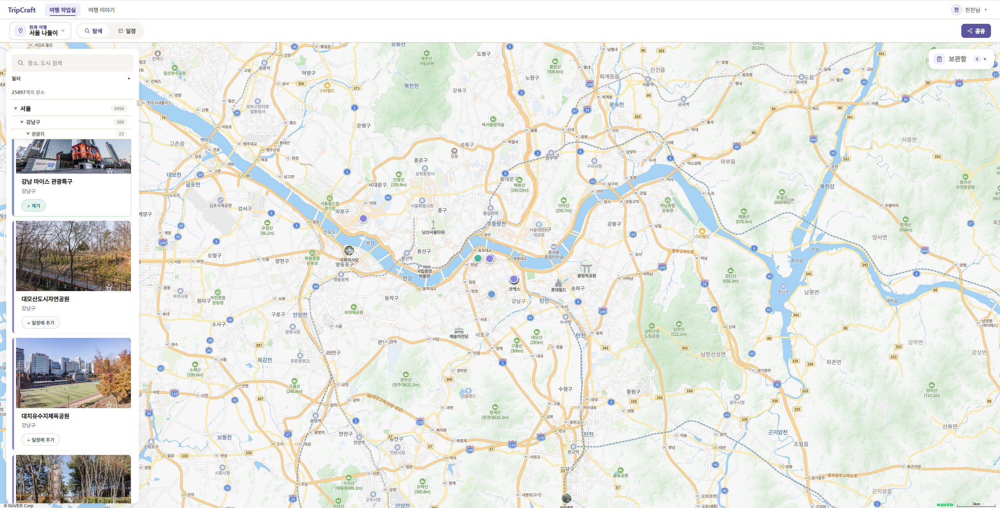
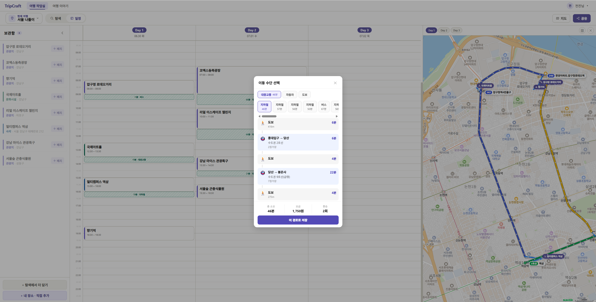
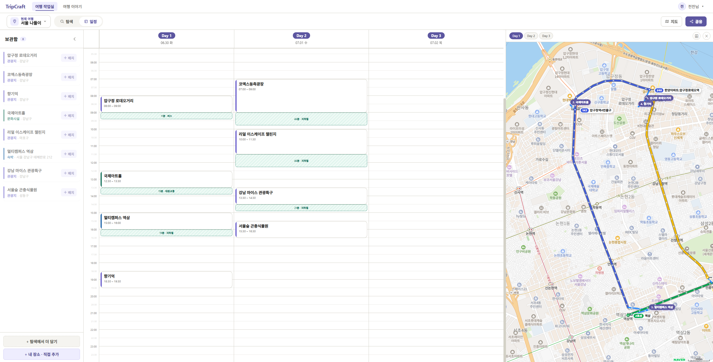
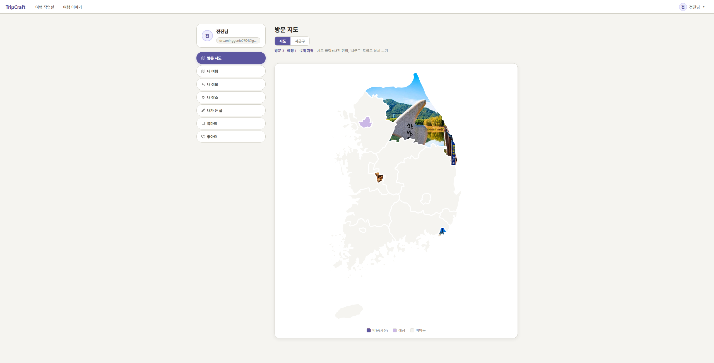
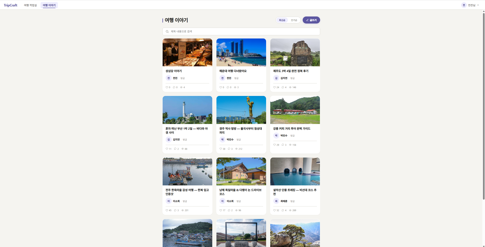
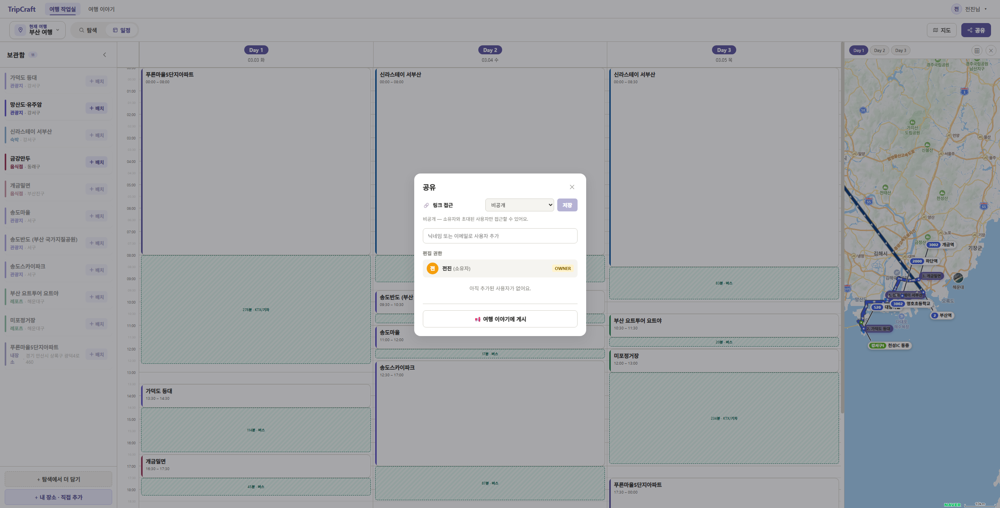

# TripCraft 🗺️

> 관광지 탐색부터 드래그앤드롭 일정 확정, 대중교통 이동시간 자동 계산, 실시간 협업 편집, 커뮤니티 공유까지 — 국내 여행 일정 플래너.

**SSAFY 11기 자율 프로젝트** · 2인 팀 캡스톤(전진 · 송정기) · 현재 1인 추가 개발 진행 중.

---

## 1. 프로젝트 소개

기존 관광 서비스는 장소 *조회*에 머물러, 여행자가 장소 간 **이동 시간**과 **일정 충돌**을 직접 계산해야 한다. TripCraft는 공공데이터 관광지 정보에 지도·길찾기 API를 결합해, 일정표에 장소를 배치하면 **이동 시간이 자동 계산**되는 현실적인 여행 계획 도구를 제공한다. 나아가 여러 사용자가 **하나의 일정을 실시간으로 함께 편집**하고, 완성한 일정을 **커뮤니티에 공유**할 수 있다.

## 2. 핵심 기능

| 기능 | 설명 |
|------|------|
| 🔍 관광지 탐색 | 지역·카테고리별 조회 (한국관광공사 TourAPI 기반 DB 수집) |
| 🗓️ 일정 편집 | 후보 장소 등록 → 드래그앤드롭으로 일정 확정 |
| 🚇 이동시간 자동 계산 | ODsay·T Map 연동, 대중교통/자동차 구간·도보 경로 지도 시각화 |
| 👥 실시간 협업 | STOMP 기반 동시 편집 — 낙관적 락 + grab 게이트로 동시성 제어 |
| 🤖 AI 챗봇 | Spring AI 기반 관광지 주변 추천 |
| 📌 마이페이지 | 방문 지도, 내 장소·일정 관리 |
| 💬 커뮤니티 | 여행 일정 공유 게시판, 댓글·좋아요, 공지사항 |
| 🔐 회원 | JWT(쿠키) 인증, 카카오 소셜 로그인 |

## 3. 화면

| 탐색 | 이동시간·경로 | 실시간 협업 일정 |
|---|---|---|
|  |  |  |

| 방문 지도 | 커뮤니티 | 공유 |
|---|---|---|
|  |  |  |

## 4. 기술 스택

| Layer | 기술 |
|-------|------|
| Backend | Java 21 · Spring Boot 3.5 · Spring Security(JWT) · MyBatis · MySQL 8.0 · Gradle(Kotlin DSL) |
| Frontend | Vue 3 · Vite · Pinia · Vue Router |
| 실시간 | WebSocket · STOMP (in-memory broker) |
| AI | Spring AI (gms, OpenAI 호환 프록시) |
| External API | 한국관광공사 TourAPI 4.0 · ODsay · T Map · Naver Maps · Kakao OAuth |
| 배포 | Docker Compose · nginx |

## 5. 아키텍처

```
브라우저 ──https──> [nginx] ┬─ /            → Vue dist (SPA)
                            ├─ /api,/uploads → Spring Boot :8080
                            └─ /ws           → STOMP (WebSocket)
                                  [backend :8080] ── [MySQL]
   외부: TourAPI · ODsay · T Map · Naver Maps · Kakao · gms(AI)
```

핵심 설계(멀티모달 이동시간 오케스트레이션, 실시간 협업 동시성, 이미지 생명주기 등)는 [docs/architecture.md](docs/architecture.md) 참조.

## 6. 실행

```bash
# DB
mysql -u<user> -p tripcraft < docs/sql/schema.sql
# 백엔드
cd backend && ./gradlew bootRun
# 프론트
cd frontend && npm install && npm run dev
```
환경 변수·배포 등 상세는 [docs/setup.md](docs/setup.md).

## 7. 문서

| 문서 | 내용 |
|------|------|
| [architecture.md](docs/architecture.md) | 시스템 구성·도메인 지도·횡단 관심사 |
| [api.md](docs/api.md) | REST + WebSocket API 명세 (Swagger UI: `/swagger-ui.html`) |
| [frontend.md](docs/frontend.md) | 프론트엔드 아키텍처 (Vue·Pinia·라우팅·실시간 클라이언트) |
| [database.md](docs/database.md) · [database.dbml](docs/database.dbml) | ERD(Mermaid/DBML)·스키마 |
| [setup.md](docs/setup.md) | 실행·배포 가이드 |
| [conventions.md](docs/conventions.md) | 개발 컨벤션 |
| [features/](docs/features/) | 도메인 심화 설계노트 (실시간 협업·경로 계산·이미지 등) |
| [capstone-1.0/](docs/capstone-1.0/) | 캡스톤 제출 산출물 아카이브(동결) |

변경 이력은 [CHANGELOG.md](CHANGELOG.md).

## 8. 팀

2인 공동 개발 — **전진 · 송정기** (SSAFY 11기).
캡스톤(v1.0) 이후 추가 개발은 전진이 단독으로 진행한다.

> 상세 역할 분담은 [docs/capstone-1.0/](docs/capstone-1.0/) 산출물 참조.

## 9. 라이선스

별도 명시 전까지 모든 권리는 원저작자(전진·송정기)에게 있다.
