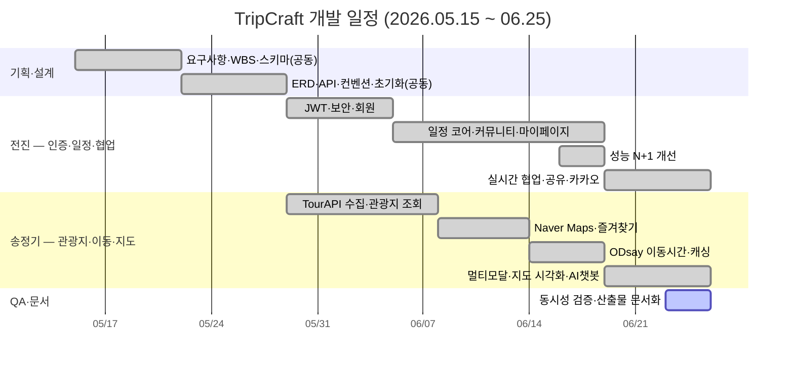

# WBS & 간트 차트 — TripCraft (final)

> **버전**: final (실제 수행 기준)
> **기간**: 2026.05.15 ~ 2026.06.25 (약 6주)
> **인원**: 2인 (전진 · 송정기)
> **비고**: 개발 전 `wbs.md`(v0.2) 대체. 계획 당시 "Phase 2"로 분리했던 실시간 공동편집·공유링크·커스텀 장소·
> 카카오 로그인·멀티모달 이동수단·AI 챗봇이 **모두 구현 완료**되어 최종 실적으로 반영. 브랜치 전략은 실제 `master` ← `feature/*`.

---

## 전체 일정 요약

| 단계 | 기간 | 주요 내용 | 상태 |
|------|------|-----------|:----:|
| 1 — 기획 | W1 (05.15~05.21) | 요구사항, WBS, DB 스키마 설계, 협업/AI 환경 | ✅ |
| 2 — 설계 | W2 (05.22~05.28) | ERD·API 설계, 컨벤션, 프로젝트 초기화, 외부 API 키 | ✅ |
| 3 — 개발(코어) | W3~W5 (05.29~06.18) | 인증·관광지·즐겨찾기·일정·이동시간·커뮤니티·마이페이지 | ✅ |
| 4 — 고도화 | W6 (06.19~06.25) | 실시간 협업·공유·커스텀 장소·카카오·멀티모달·AI 챗봇 | ✅ |
| 5 — QA·문서 | W6 (06.19~06.25) | 동시성 검증, 산출물 문서화 | 🔄 |

---

## 단계별 WBS

### 1단계 — 기획 (W1)
- [x] GitLab 레포·브랜치 전략, 디렉토리 구조, 역할 분담
- [x] 요구사항 명세·기능 우선순위 (Phase 1/2)
- [x] DB 스키마 DDL 1차 설계 (`schema.sql`)
- [x] Claude 에이전트 협업 환경 (`CLAUDE.md`, `.claude/*`)

### 2단계 — 설계 (W2)
- [x] ERD·스키마 확정, 도메인별 컨텍스트 문서
- [x] API 설계(회원·관광지·일정·커뮤니티), 공통 응답 형식
- [x] 코딩 컨벤션·Git 컨벤션 (`conventions.md`)
- [x] Spring Boot(Java 21, MyBatis, Security)·Vue 3(Vite) 초기화
- [x] 외부 API 키 발급·연동 테스트 (TourAPI·ODsay·Naver Maps)

### 3단계 — 개발 코어 (W3~W5)
**회원·인증 (F-AUTH)**
- [x] Member·JWT·Spring Security, 회원가입·로그인·로그아웃·재발급
- [x] 회원 정보/닉네임/비밀번호 수정, 프로필 이미지, 회원 탈퇴

**관광지 (F-ATTR)**
- [x] TourAPI 데이터 수집·증분 동기화, 전국 적재
- [x] 지역·카테고리·키워드 검색, 상세(detail*), Naver Maps 마커 연동

**즐겨찾기·내 장소 (F-FAV)**
- [x] 즐겨찾기 추가/해제·목록, 방문 지역 지도

**일정 (F-PLAN)**
- [x] 일정 생성·목록·상세·삭제
- [x] 보관함(후보군) 추가, 드래그 앤 드롭 블록 배치·순서·시간·메모

**이동 시간 (F-TRANSIT)**
- [x] ODsay 대중교통 이동시간 자동 계산, 경로 단계 상세
- [x] 이동시간·노선 폴리라인 캐시 (`transit_cache`·`lane_polyline`)

**커뮤니티 (F-COMMUNITY)**
- [x] 게시글 CRUD(소프트 딜리트)·목록(정렬·검색)·상세(일정 뷰어)
- [x] 좋아요·댓글/대댓글·북마크, 공지사항, 관리자 작성
- [x] 게시글 목록 N+1 개선(파생 테이블 JOIN)

**마이페이지**
- [x] 내 일정/프로필/장소/지도/게시글/북마크/좋아요 탭

### 4단계 — 고도화 (W6)
- [x] 실시간 공동 편집 — STOMP 프레즌스(커서·아바타), 블록 동기화
- [x] 동시성 정책 — 낙관적 락(`version`)·grab 게이트·시간 겹침 직렬화
- [x] 공유 링크(PRIVATE/VIEW/EDIT)·공유 일정 복제
- [x] 커스텀 장소(Kakao Local 검색)·내 장소 재사용
- [x] 카카오 소셜 로그인
- [x] 멀티모달 이동수단 — T Map 자동차 4옵션·도보, 경로 지도 시각화
- [x] 관광지 AI 챗봇 (Spring AI, 컨텍스트 주입 멀티턴)

### 5단계 — QA·문서 (W6)
- [x] 백엔드 `compileJava` / 프론트 `vite build` 검증
- [ ] 다인원 동시 편집 E2E 실사용 검증
- [ ] 산출물 문서 최종화 (요구사항·ERD·API·기술노트·발표자료)

---

## 개인별 일정 (주 담당)

> 기획·DB 스키마 설계는 **공동 수행**. 이후 도메인별로 주 담당을 나누되 리뷰·통합은 함께 진행.
> 커밋 기준 기여: 송정기 181 · 전진 121.

### 전진 (jin) — 인증·일정 코어·협업·커뮤니티
| 주차 | 작업 |
|------|------|
| W1~2 | 공동 기획·스키마, Claude 환경, 프로젝트/보안 기반 세팅 |
| W3 | JWT·Spring Security 인증, 회원 도메인 |
| W4~5 | 일정 코어(trip·candidate·block), 커뮤니티·공지, 마이페이지 |
| W5 | 성능 개선(프로필 이미지 N+1 → 파생 테이블 JOIN) |
| W6 | 실시간 협업 동시성(낙관적 락·grab·행 직렬화), 공유 링크, 카카오 로그인 |

### 송정기 — 관광지·지도·이동시간·외부 API
| 주차 | 작업 |
|------|------|
| W1~2 | 공동 기획·스키마, 외부 API 키·연동 테스트 |
| W3~4 | TourAPI 수집·증분 동기화, 관광지 조회, Naver Maps 연동 |
| W5 | ODsay 대중교통 이동시간 자동 계산·캐싱 |
| W6 | 멀티모달(T Map 자동차·도보)·경로 지도 시각화, 커스텀 장소(Kakao Local), AI 챗봇 |

---

## 간트 차트

> 위 Mermaid 간트는 GitLab/VS Code에서 바로 렌더된다. 기존 `tripcraft_gantt.html`은 시각 산출물 버전으로 별도 유지.

---

## 마일스톤

| 마일스톤 | 시점 | 완료 기준 | 상태 |
|----------|------|-----------|:----:|
| M1 — 설계 완료 | W2末 | ERD·API·컨벤션·초기화 | ✅ |
| M2 — 인증+관광지 | W4末 | 로그인·관광지 조회·즐겨찾기 | ✅ |
| M3 — 일정 코어 | W5末 | 블록 시간표·이동시간 자동 계산 | ✅ |
| M4 — 커뮤니티 | W5末 | 게시글·댓글·공지 | ✅ |
| M5 — 고도화 | W6 | 협업·공유·멀티모달·AI 챗봇 | ✅ |
| M6 — 제출 | W6末 | QA·산출물 문서·발표자료 | 🔄 |

---

## 리스크 및 대응 (실제 대응)

| 리스크 | 대응 결과 |
|--------|-----------|
| 외부 API 호출 제한(ODsay/TMap) | 다층 캐시(DB 2 + in-memory 2), 성공 결과만 저장 → 빈 응답 회귀 차단 |
| 실시간 공동 편집 동시성 | 낙관적 락 + grab 게이트 + `trip` 행 직렬화로 데이터 유실 방지 |
| 드래그 시간표 구현 복잡도 | vue-draggable + 시간 겹침 선검사로 해결 |
| 관광지 API 할당량 | 초기 일괄 적재 후 DB 조회, 증분 동기화 |
| 2인 일정 부담 | 도메인 주 담당 분리 + AI 보조(Claude Code) 활용 |
