# TripCraft ERD

> **단일 소스**: [`schema.sql`](./schema.sql) v0.5 (24 tables)
> **제출용 메인**: [`tripcraft_erd.dbml`](./tripcraft_erd.dbml) — [dbdiagram.io](https://dbdiagram.io)에 붙여넣어 자동 레이아웃 후 PNG/PDF/SVG export
> **본 문서**: GitLab 인라인 렌더용 Mermaid 미러
>
> 관계 표기: `||--o{` 1:N, `||--||` 1:1, `}o--||` N:1.
> 라벨 끝 `(SET NULL)` / `(RESTRICT)` 는 ON DELETE 정책(미표기는 CASCADE).
> `sido`/`sigungu` ↔ `attraction` 은 DDL상 FK 제약이 없는 **논리적 관계**.

```mermaid
erDiagram
  %% ---------- 회원·인증 ----------
  member {
    bigint id PK
    varchar email UK
    varchar nickname
    varchar password
    enum role "USER|ADMIN"
    varchar social_provider
    varchar social_id
  }
  member_token {
    bigint id PK
    bigint member_id FK
    varchar refresh_token
    datetime expires_at
  }

  %% ---------- 지역·관광지 ----------
  sido {
    tinyint sido_code PK
    varchar name
    varchar alias
  }
  sigungu {
    tinyint sido_code PK
    tinyint sigungu_code PK
    varchar name
    varchar alias
  }
  attraction {
    bigint id PK
    varchar content_id UK
    tinyint content_type_id
    varchar title
    tinyint sido_code
    tinyint sigungu_code
    decimal latitude
    decimal longitude
    datetime api_modified_at
  }
  attraction_detail_common {
    varchar content_id PK,FK
    text overview
    varchar homepage
  }
  attraction_detail_intro {
    varchar content_id PK,FK
    tinyint content_type_id
    json intro_data
  }
  attraction_detail_image {
    bigint id PK
    varchar content_id FK
    varchar originimgurl
  }
  attraction_detail_info {
    bigint id PK
    varchar content_id FK
    varchar infoname
    json room_data
  }
  favorite {
    bigint id PK
    bigint member_id FK
    bigint attraction_id FK
  }

  %% ---------- 여행·협업 ----------
  trip {
    bigint id PK
    bigint member_id FK
    varchar title
    date start_date
    date end_date
    varchar default_transit_mode
    enum share_access "PRIVATE|VIEW|EDIT"
    char share_token UK
  }
  trip_candidate {
    bigint id PK
    bigint trip_id FK
    bigint attraction_id FK "NULL=커스텀"
    enum source "MANUAL|FAVORITE|CUSTOM"
    varchar place_name
    decimal place_lat
    decimal place_lng
  }
  member_place {
    bigint id PK
    bigint member_id FK
    varchar name
    varchar category
    decimal latitude
    decimal longitude
  }
  trip_collaborator {
    bigint id PK
    bigint trip_id FK
    bigint member_id FK
    enum role "EDITOR|VIEWER"
  }
  trip_block {
    bigint id PK
    bigint candidate_id FK
    date trip_date
    tinyint display_order
    time start_time
    smallint duration_minutes
    smallint transit_duration_minutes
    int version "낙관적 락"
  }

  %% ---------- 이동·시스템 (독립) ----------
  transit_cache {
    bigint id PK
    varchar route_key UK
    tinyint departure_hour
    varchar request_mode
    smallint duration_minutes
    json path_detail
  }
  lane_polyline {
    bigint id PK
    varchar map_object_key UK
    mediumtext route_coords
  }
  system_config {
    varchar config_key PK
    varchar config_value
  }

  %% ---------- 커뮤니티·첨부 ----------
  post {
    bigint id PK
    bigint member_id FK "NULL=탈퇴"
    bigint trip_id FK "NULL=일정삭제"
    varchar title
    int like_count
    datetime deleted_at "소프트딜리트"
  }
  post_like {
    bigint id PK
    bigint post_id FK
    bigint member_id FK
  }
  post_comment {
    bigint id PK
    bigint post_id FK
    bigint member_id FK "NULL=탈퇴"
    bigint parent_id FK "대댓글 1단계"
    varchar content
  }
  post_bookmark {
    bigint member_id PK,FK
    bigint post_id PK,FK
    datetime created_at
  }
  notice {
    bigint id PK
    bigint member_id FK "NULL=관리자삭제"
    varchar title
    text content
  }
  attach {
    bigint id PK
    varchar name
    varchar target "profile|post|post_draft"
    bigint target_id "다형 참조"
  }

  %% ---------- 관계 (FK) ----------
  member ||--o{ member_token : "has"
  member ||--o{ favorite : "bookmarks"
  member ||--o{ trip : "owns"
  member ||--o{ member_place : "saves"
  member ||--o{ trip_collaborator : "joins"
  member |o--o{ post : "writes (SET NULL)"
  member ||--o{ post_like : "likes"
  member |o--o{ post_comment : "writes (SET NULL)"
  member ||--o{ post_bookmark : "bookmarks"
  member |o--o{ notice : "authors (SET NULL)"

  attraction ||--|| attraction_detail_common : "detail"
  attraction ||--|| attraction_detail_intro : "intro"
  attraction ||--o{ attraction_detail_image : "images"
  attraction ||--o{ attraction_detail_info : "info"
  attraction ||--o{ favorite : "favorited"
  attraction |o--o{ trip_candidate : "candidate"

  trip ||--o{ trip_candidate : "has"
  trip ||--o{ trip_collaborator : "shared"
  trip |o--o{ post : "shared as (SET NULL)"
  trip_candidate ||--o{ trip_block : "placed (RESTRICT)"

  post ||--o{ post_like : "liked"
  post ||--o{ post_comment : "commented"
  post ||--o{ post_bookmark : "bookmarked"
  post_comment |o--o{ post_comment : "reply"

  %% ---------- 논리적 관계 (DDL상 FK 없음) ----------
  sido ||..o{ sigungu : "logical"
  sido ||..o{ attraction : "logical"
  sigungu ||..o{ attraction : "logical"
```

## 비고

- **독립 테이블(FK 없음)**: `transit_cache`, `lane_polyline`, `system_config`, `attach` — 외부 API 캐시·설정·다형 첨부라 의도적으로 FK 제약 없음.
- **`attach`의 다형 참조**: `target`(profile/post/post_draft) + `target_id`로 `member`/`post`를 가리키며, DB FK가 아닌 앱 레이어에서 무결성 관리.
- **삭제 정책 요약**: 회원 탈퇴는 하드 딜리트(연관 데이터 CASCADE), 단 `post`·`post_comment`·`notice`는 작성자 `SET NULL`로 콘텐츠 보존. `trip_block`→`trip_candidate`는 `RESTRICT`(모달 확인 UX).
