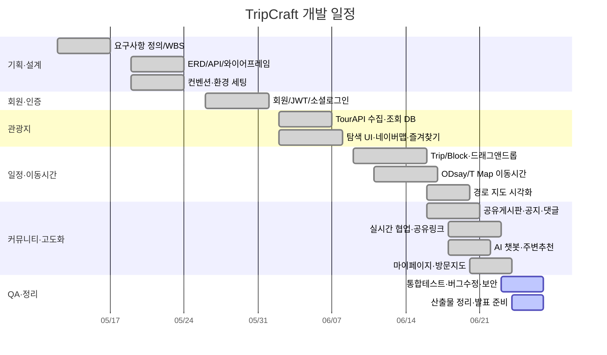

# WBS & 간트 차트 — TripCraft

> **기준 일정**: 약 6주 · **개발 인원**: 2인 (전진 · 송정기)
> 인터랙티브 간트: [`gantt.html`](./gantt.html) (브라우저에서 열람)

---

## 1. 전체 일정 요약

| 단계 | 기간 | 주요 내용 |
|------|------|-----------|
| 1단계 — 기획 | Week 1 | 요구사항 정의, WBS, 협업 환경 세팅 |
| 2단계 — 설계 | Week 2 | ERD, API 명세, UI 와이어프레임, 코딩 컨벤션 |
| 3단계 — 개발 | Week 3 ~ 5 | 회원 → 관광지·즐겨찾기 → 일정·이동시간 구현 |
| 4단계 — 커뮤니티·고도화 | Week 6 ~ | 공유게시판·공지, 협업·공유, AI 챗봇, 마이페이지 |
| 5단계 — QA·정리 | 막바지 | 통합 테스트, 버그 수정, 보안 점검, 산출물 정리 |

---

## 2. 간트 차트 (Mermaid)

---

## 3. 단계별 상세 (WBS)

### 1단계 — 기획 (Week 1) ✅
- 레포지토리·브랜치 전략, 디렉터리 구조(`backend/`·`frontend/`·`docs/`), 역할 분담
- 사용자 스토리 작성, 요구사항 명세서(`requirements.md`), 기능 우선순위(Phase 1/2)
- WBS·간트 작성, 주차별 마일스톤 확정

### 2단계 — 설계 (Week 2) ✅
- 시스템 구조도, Use-case 다이어그램
- ERD 설계·확정(회원·관광지·즐겨찾기·일정·게시글·공지)
- 회원/관광지/일정/커뮤니티 API 명세
- 와이어프레임(메인·탐색·일정편집·커뮤니티·인증)
- 코딩 컨벤션, 백/프론트 로컬 환경 세팅

### 3단계 — 개발 (Week 3~5) ✅
- **회원**: Member·JWT·Spring Security, 회원가입/로그인/로그아웃/수정/탈퇴, 헤더 상태 반영
- **관광지**: TourAPI 수집 배치, 지역·카테고리·키워드 조회, 상세 슬라이드, 네이버맵 마커
- **즐겨찾기**: 토글 API, 목록, 도시 첫 추가 시 자동 연동
- **일정**: Trip·TripBlock, 드래그앤드롭 타임라인, 후보군 도시 자동분류
- **이동시간**: ODsay(대중교통)·T Map(자동차·도보), 모드별 캐시, 경로 폴리라인 시각화

### 4단계 — 커뮤니티·고도화 (Week 6~) ✅
- **커뮤니티**: 공유게시판(작성/목록/상세/수정/삭제), 공지 CRUD, 댓글·대댓글, 좋아요·북마크
- **협업**: WebSocket(STOMP) 실시간 동기화, 낙관적 락, 공유 링크(VIEW/EDIT), 협업자 초대
- **AI 챗봇**: Spring AI + gms, 관광지 컨텍스트 Q&A, 반경 3km 주변 추천
- **마이페이지**: 7탭(여행·내정보·내장소·방문지도·내가쓴글·북마크·좋아요), 방문 지도

### 5단계 — QA·정리 (막바지) 🔄
- 통합 E2E 테스트, 이동시간 정확도 검증, 크로스 브라우저
- 버그 수정·반응형 점검, 보안 일괄 점검
- 산출물(설계문서·PPT·AI보고서) 정리

---

## 4. 개인별 일정 (도메인 분담)

> 2인 페어가 도메인을 나누어 병렬 진행하고, 핵심 화면(일정 편집)·협업 기능은 공동 작업했다.

| 주차 | 전진 | 송정기 |
|------|------|--------|
| W1~2 | 요구사항·유스케이스, API 명세 | ERD·스키마, 컨벤션·환경 세팅 |
| W3 | 관광지 TourAPI 수집·조회 | 회원·JWT·Spring Security |
| W4 | 관광지 탐색 UI·네이버맵 | 즐겨찾기·후보군 자동연동 |
| W5 | 이동시간(ODsay/T Map)·경로 시각화 | 일정 드래그앤드롭 타임라인 |
| W6~ | AI 챗봇·커뮤니티 게시판 | 실시간 협업·공유링크·마이페이지 |

> 실제 커밋 이력 기준 세부 분담은 팀에서 확정·보정. (Git 작성자·MR 이력으로 추적 가능)

---

## 5. 마일스톤

| 마일스톤 | 목표 | 완료 기준 | 상태 |
|----------|------|-----------|------|
| M1 — 설계 완료 | Week 2 | ERD·API·와이어프레임 확정 | ✅ |
| M2 — 회원+관광지 | Week 4 | 로그인·관광지 조회·즐겨찾기 동작 | ✅ |
| M3 — 일정 기능 | Week 5 | 드래그 타임라인·이동시간·저장 동작 | ✅ |
| M4 — MVP+고도화 | Week 6 | 커뮤니티·협업·AI 챗봇·마이페이지 동작 | ✅ |
| M5 — 제출 | 막바지 | QA·산출물·발표 준비 완료 | 🔄 |

## 6. 리스크 & 대응

| 리스크 | 대응 |
|--------|------|
| TourAPI 할당량 초과 | 초기 일괄 적재 후 DB 서비스, call limiter |
| ODsay/T Map 응답 지연·쿼터 | 좌표 기반 모드별 캐시 + 노선 폴리라인 영구 캐시 |
| 드래그앤드롭 구현 복잡도 | vue-draggable 활용 |
| 실시간 협업 동시 편집 충돌 | `version` 낙관적 락으로 후행 저장 거부·재동기화 |
| 2인 일정 지연 | 주 1회 동기화, 우선순위 재조정 |
