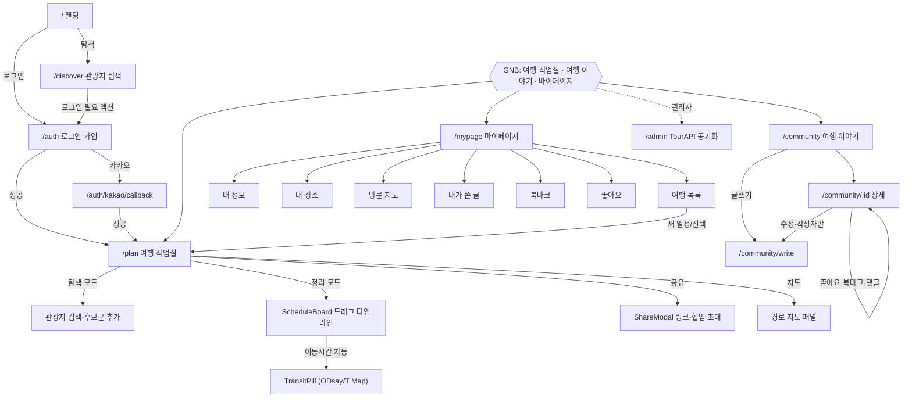

# 화면 설계서 — TripCraft

> **기준**: `frontend/src/router/index.js` · `frontend/src/views` · 디자인 시스템(`docs/02_design/tripcraft_figma_spec_v0.2.md`, `design_system.md`)
> Vue 3 + Vite · Pinia · Vue Router. IA(정보구조) 단위로 라우트를 구획했다.

---

## 1. 정보 구조(IA) & 라우트

| 그룹 | 경로 | 화면 | 권한 |
|------|------|------|------|
| 공개 | `/` | LandingView (히어로·CTA) | 비회원 |
| 공개 | `/about` | AboutView (소개·기술·팀) | 비회원 |
| 공개 | `/discover` | ExploreView (관광지 탐색) | 비회원 전용(로그인 시 `/plan`) |
| 인증 | `/auth` | AuthView (로그인/회원가입·카카오) | 비회원 |
| 인증 | `/auth/kakao/callback` | KakaoCallbackView | 비회원 |
| 작업실 | `/plan/:tripId?` | PlanView (탐색·정리 통합) | 회원(공유링크 예외) |
| 커뮤니티 | `/community` | CommunityView (목록) | 비회원 열람 |
| 커뮤니티 | `/community/write`, `/community/:id/edit` | CommunityWriteView | 회원 |
| 커뮤니티 | `/community/:id` | CommunityPostView (상세) | 비회원 열람 |
| 관리자 | `/admin` | AdminView (TourAPI 동기화) | 관리자 |
| 마이페이지 | `/mypage` + 7탭 | MyPageLayout → trips·profile·places·map·posts·bookmarks·likes | 회원 |
| 오류 | `/:pathMatch(.*)*` | NotFoundView | - |

**라우트 가드(`router.beforeEach`)**: `meta.requiresAuth` 검사, 로그인 사용자의 `/discover`→`/plan` 리다이렉트, 공유 링크(`/plan/:id?s=token`) 비로그인 조회 허용, `requiresAdmin` 역할 검사. 구 경로(`/explore`·`/schedule`·`/trips`·`/calendar`)는 하위호환 리다이렉트.

---

## 2. 화면 흐름도 (Mermaid)

---

## 3. 주요 화면 명세

| 화면 | 핵심 구성 | 주요 인터랙션 |
|------|-----------|---------------|
| **LandingView** | 히어로·태그라인·기능 소개·CTA | 탐색/로그인 진입 |
| **ExploreView** | 네이버맵 + 좌측(검색·지역/시군구/카테고리 필터·목록) | 마커 핀·InfoWindow, 상세 슬라이드, 후보군 드래그 |
| **AuthView** | 로그인/회원가입 탭, 이메일·비밀번호, 카카오 버튼 | 폼 검증, OAuth |
| **PlanView (작업실)** | 헤더(일정 선택·모드 토글·협업 아바타·공유/지도) + 탐색 사이드바/ScheduleBoard | 모드 전환, 드래그앤드롭, 실시간 협업 커서 |
| **ScheduleBoard** | Day 탭 × 시간 그리드, 후보군 사이드바, TransitPill, 지도 패널 | 블록 드래그·체류시간 핸들·삭제존, 이동수단 드롭다운 |
| **CommunityView** | 정렬(최신/인기)·검색·글쓰기, PostCard 그리드 | 카드 클릭→상세 |
| **CommunityWriteView** | 제목·커버 업로드·Tiptap 에디터·일정 연결 | 작성/수정 |
| **CommunityPostView** | 제목·커버·본문·작성자·연결 일정·댓글 | 좋아요/북마크/댓글, 작성자 수정·삭제 |
| **MyPage 7탭** | 셸(아바타·인사·계정뱃지) + 탭 라우터뷰 | 프로필 편집, 내 장소 CRUD, 방문 지도 |
| **AdminView** | TourAPI 전체/부분 동기화 컨트롤 | 지역·콘텐츠타입 선택 동기화 |

---

## 4. 디자인 시스템 요약

| 토큰 | 값 |
|------|-----|
| 주요 색상 | purple(주조)·teal·pink·blue·amber + grays |
| 타이포 | heading / body / label / caption 스케일 |
| 간격 | 4px ~ 28px 스텝 |
| 컴포넌트 | Button·Input·Card·Modal·Chip·Tab, GNB(3탭)·사이드바·푸터 |
| 반응형 | 데스크톱(1280px+) 우선, 태블릿(768px) 지원 |
| 상태 처리 | 로딩(스피너/스켈레톤)·빈 상태(EmptyState)·토스트(AppToast) |

> 상세 토큰·프레임은 `docs/02_design/tripcraft_figma_spec_v0.2.md`, UX 재설계 의사결정은 `ux_replan_v2.md` 참조.

---

## 5. 상태 관리(Pinia)

| 스토어 | 역할 |
|--------|------|
| `auth` | 사용자·로그인 상태, login/signup/kakaoLogin/logout/fetchMe |
| `activeTrip` | 현재 활성 일정 id (localStorage 유지) |
| `collab` | 실시간 협업 참가자·grab lock·색상·WebSocket(STOMP) 연결 |
| `attractionChat` | 관광지별 챗봇 세션(messages·conversationId)·아코디언 상태 |
| `toast` | 전역 토스트 메시지 |
