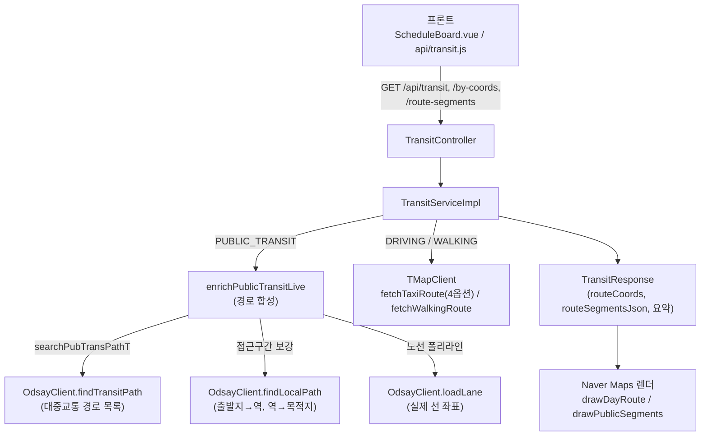
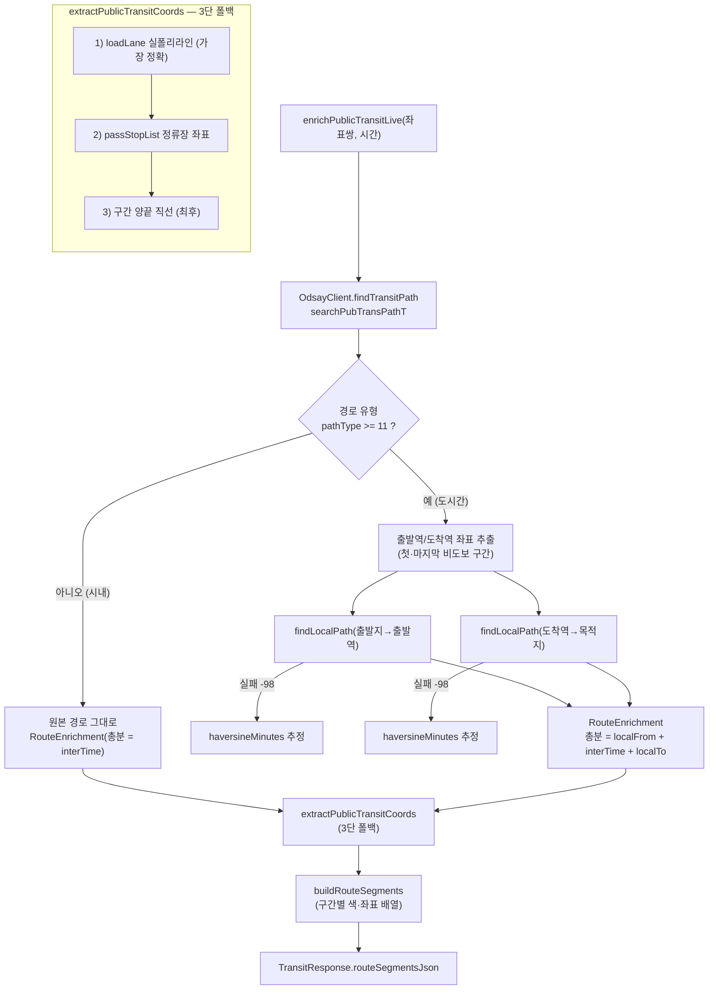
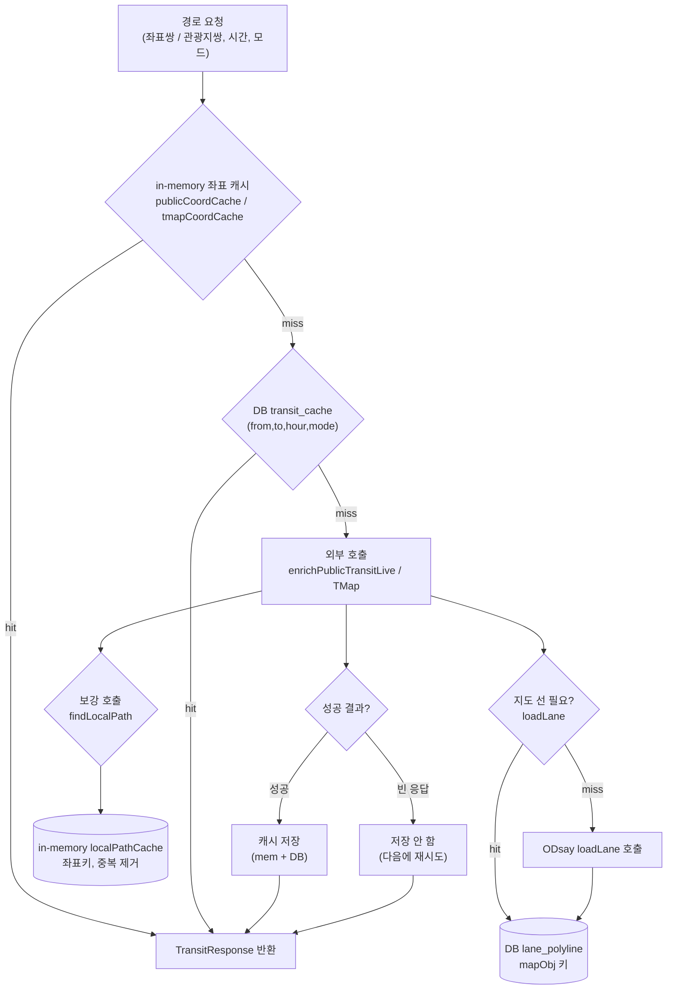

# 기술 심화 — 경로 최적화 & 지도 시각화

작성자: 송정기
관련 코드: `plan/service/TransitServiceImpl.java`, `plan/client/OdsayClient.java`, `plan/client/TMapClient.java`,
`plan/controller/TransitController.java`, `components/ScheduleBoard.vue`(지도·구간), `api/transit.js`,
`mapper/plan/TransitCacheMapper.xml`, `mapper/plan/LanePolylineMapper.xml`
상세 원문: `docs/03_dev/transit_external_api.md`

> 여행 일정의 두 장소 사이 "이동수단별 경로"를 **자동으로 계산**하고 그 경로를 **지도에 실제처럼 시각화**하는 기능.
> 프로젝트에서 기술적으로 가장 복잡했던 작업이다. 핵심은 (1) 한 API로 부족한 경로를 **여러 호출로 합성**하고,
> (2) 무료 API의 **호출 제한(rate limit)** 을 견디는 **다층 캐싱**을 설계한 것이다.

---

## 0. 왜 이렇게 만들었나 — 무료 API 조합

"출발지에서 목적지까지 대중교통/자동차로 몇 분"을 구하는 가장 쉬운 길은 **유료 길찾기 API**(Kakao Mobility 길찾기 등)를 한 번 호출하는 것이다. 좌표 두 개를 넘기면 소요시간·경로·폴리라인을 한 응답으로 돌려준다.

우리는 **비용을 피하려고 무료 API 조합**을 택했다. 대중교통은 ODsay, 자동차·도보는 TMap, 지도 렌더는 Naver Maps를 쓴다. 각 무료 API는 자기 영역만 잘하므로, 유료 단일 API가 한 번에 주던 결과를 **우리가 직접 합성·파싱**해야 한다.

| 접근 | 사용 API | 비용 | 대가(기술 부담) |
|------|----------|------|----------------|
| 유료 단일 | Kakao Mobility 길찾기 | 호출당 과금 | 거의 없음(응답 그대로 사용) |
| **무료 조합(채택)** | ODsay(대중교통) + TMap(자동차·도보) + Naver(렌더) | 무료 | ① 응답을 직접 **합성·파싱** ② 호출 제한을 **캐시로 방어** |

즉 "무료"의 대가가 이 보고서의 두 축이다 — **§2 합성(조립)** 과 **§3 캐싱**.

---

## 1. 전체 그림 (한눈에)

경로 하나에 외부 API 4종이 얽힌다. 프론트가 모드(대중교통/자동차/도보)를 넘기면 백엔드가 해당 API를 호출·합성해 좌표와 요약을 만들고, 프론트가 Naver 지도에 그린다.



어려움의 본질은 세 가지다.

1. **파싱** — ODsay 응답이 깊게 중첩된 JSON(`path[].subPath[]`, 교통수단 코드)이라 의미 단위로 풀어야 한다.
2. **조합** — 한 호출로 끝나지 않는다. 도시간(KTX) 경로는 "역→역"만 주므로 접근 구간을 **추가 호출로 합성**하고, 지도 선은 또 **별도 호출**(`loadLane`)로 그린다.
3. **호출 제한** — 무료 API라 같은 좌표를 짧게 반복 호출하면 **빈 응답**을 준다 → 캐싱이 필수.

---

## 2. 외부 API 오케스트레이션 (조립)

### ① 왜 한 번으로 안 끝나나

ODsay의 도시간 경로(`pathType >= 11`, 열차·고속/시외버스)는 **출발역→도착역 구간만** 반환한다. "우리 집 → 서울역", "부산역 → 목적지" 같은 **접근 구간이 빠져서** 총 소요시간이 비현실적으로 짧게 나왔다. (시내 경로 `pathType < 11` 은 그대로 쓴다.)

### ② 어떻게 합성했나

도시간 경로마다 **로컬 경로를 추가로 호출**해 앞뒤에 붙인다 (`enrichPublicTransitLive`).

```
[출발지] --findLocalPath--> [출발역] ==KTX(원래 응답)== [도착역] --findLocalPath--> [목적지]
   localFrom(예: 46분)            interTime(138분)            localTo(예: 20분)
                         총 = localFrom + interTime + localTo
```

- 비-도보 첫 구간의 시작좌표 = 출발역, 마지막 비-도보 구간의 끝좌표 = 도착역으로 잡고
  `findLocalPath(출발지→출발역)`, `findLocalPath(도착역→목적지)` 를 호출한다.
- 로컬 경로 API가 실패하면(700m 이내 등 `-98` 코드) **하버사인 거리 기반 추정**(`haversineMinutes`, 평균 30km/h)으로 폴백한다.
- 결과를 `RouteEnrichment(원본, 총분, localFrom, localTo)` 레코드로 담아 직렬화 → 모달 스텝·지도에서 재사용.

조립 구조를 한 장으로:



**자동차(TMap)** 는 검색옵션으로 **4가지**를 각각 호출해 비교 제공한다.

| 인덱스 | searchOption | 라벨 |
|--------|--------------|------|
| 0 | `00` | 추천 |
| 1 | `02` | 최단시간 |
| 2 | `01` | 무료도로 |
| 3 | `10` | 최소거리 |

응답에서 주요 도로명(거리순 4개)으로 요약(`buildRoadSummary`)하고 통행료·택시요금·구간 좌표를 추출한다.

### ③ 어려움

- **보강 내부의 rate limit.** ODsay가 도시간 경로를 10~20개 반환하면, **경로마다** localFrom/localTo를 2번씩 호출해 한 번의 보강에서 ODsay를 20~40번 두드린다. 그러면 그 안에서 또 rate-limit에 걸려 "한두 경로만 실제 대중교통, 나머지는 추정"으로 망가졌다.
- **경로별 독립 계산 누락(2026-05-29).** 도시간 경로마다 출발역이 다른데(수서 SRT vs 서울역 KTX vs 강남 고속버스), 초기 코드는 첫 경로의 역 좌표로만 localFrom/localTo를 계산해 다른 경로 선택 시 소요시간이 틀어졌다. → 각 경로가 자기 출발역·도착역 좌표로 **독립 계산**하도록 수정.

### ④ 고민·의사결정

보강이 이 기능에서 **가장 비싼 부분**이다. `findLocalPath` 를 **좌표키로 캐시 + 중복 제거**했다. 도시간 경로 대부분이 **같은 출발역**(예: 서울역)을 공유하므로, 캐시로 20~40회 호출이 **고유 역 수(보통 1~3회)** 로 줄어든다. 이 결정이 다음 장(캐싱)의 출발점이다.

---

## 3. 다층 캐싱 (핵심 설계)

### ① 왜 캐싱이 필수인가

무료 API는 같은 좌표를 짧은 시간에 반복 호출하면 **빈 응답(rate limit)** 을 준다. 지도를 다시 그리거나 핀 모달을 열 때마다 생호출하면 금방 막힌다. 외부 호출은 느리고 제한이 있으므로, **무엇을 어디에 캐시할지가 핵심 설계**였다.

### ② 어떻게 3계층(DB 2 + in-memory 2)으로 설계했나



| 계층 | 저장소 | 키 | 대상 | 비고 |
|------|--------|-----|------|------|
| ① 이동시간 캐시 | DB `transit_cache` | (from_attr, to_attr, hour, request_mode) | 관광지쌍 경로·요약·path_detail | 모드별 행(대중교통 1 + 자동차 4), `NONE` 도 캐시해 재시도 방지 |
| ② 노선 폴리라인 | DB `lane_polyline` | mapObj 키 | `loadLane` 결과 | 결과 없음도 저장(불필요 재호출 차단) |
| ③ 좌표 결과 | in-memory `publicCoordCache`·`tmapCoordCache` | `"%.5f,%.5f>%.5f,%.5f"`(+mode) | **커스텀 장소(by-coords)** 경로 | 세션 캐시, **성공만 저장**(빈 응답 미저장→재시도), 1000개 상한 |
| ④ 도시내 로컬 경로 | in-memory `localPathCache`(OdsayClient) | 좌표키 | 보강용 `findLocalPath` 결과 | 같은 역 공유 중복 제거, 성공·추정만 저장, 2000개 상한 |

①②는 관광지(attraction id 기반) 경로용으로 처음부터 있었고, ③은 attraction id가 없는 **커스텀 장소** 때문에 추가됐다. **성공 결과만 저장**하는 게 핵심이다.

```java
List<RouteEnrichment> cached = publicCoordCache.get(key);
if (cached != null) return cached;
List<RouteEnrichment> fresh = enrichPublicTransitLive(...);
if (!fresh.isEmpty()) publicCoordCache.put(key, fresh);   // 성공만 캐시
return fresh;
```

### ③ 어려움

커스텀 장소 경로가 "가끔" 모달에 안 뜨고 지도엔 직선만 그려지는 현상이 있었다. 재현 실험:

```
by-coords/detail 같은 좌표쌍 8연타
 → try1~5: 정상(경로 있음)
 → try6~8: EMPTY (빈 응답)
```

원인은 **무캐시**였다. 지도 draw·핀 모달 open마다 ODsay/TMap을 생호출 → 같은 좌표를 짧게 5회 넘기면 ODsay가 빈 응답을 준다. 섞인 날엔 관광지 `loadLane` 호출까지 같이 굶어 관광지 지도도 깨졌다.

### ④ 고민·의사결정

- **왜 성공만 캐시하나.** 빈 응답을 캐시하면 영구히 빈 채로 굳는다. 실패는 저장하지 않아 다음에 재시도하게 했다.
- **왜 in-memory인가.** `transit_cache` 의 `route_key` 컬럼은 이미 추가해 두어 DB 승격이 가능하다. 다만 단일 인스턴스·세션 단위로는 in-memory로 충분하고 회귀 위험이 작아 우선 채택했다. 다중 인스턴스로 확장하면 DB로 올린다.

---

## 4. 지도 폴리라인 시각화

백엔드가 만든 좌표를 프론트가 Naver 지도에 그린다(`drawDayRoute` → `drawPublicSegments`).

- **좌표계 주의.** 저장은 `[lng, lat]`, Naver SDK는 `LatLng(lat, lng)` 순서다. 구간 좌표 `seg.p` 를 `([x, y]) => new naver.maps.LatLng(y, x)` 로 뒤집어 매핑한다.
- **구간별 색.** `segColor(seg)` 가 구간 종류(`seg.c`)에 따라 색을 정한다 — 지하철은 호선 공식색(2호선 초록 등), 버스는 종류색, 열차(KTX)는 검정, 도보는 점선. 비-도보 구간은 검정 casing(9px) 위에 색선(6px)을 얹어 가독성을 높인다.
- **오버레이.** `renderOverlays` 가 폴리라인을 따라 방향 화살표를 ~30px 간격으로 회전 배치하고, 역/정류장 마커와 노선번호 라벨을 그린다. 라벨은 7단 세로 오프셋으로 **충돌 회피**하고, 리더 라인(흰 casing + 진한 선)으로 실제 정류장과 연결한다.
- **커스텀 장소 접근 구간 조립.** 커스텀(좌표 기반)은 관광지용 lane 캐시를 못 써 도시간 경로 선이 처음엔 KTX 역–역 직선만 그려졌다. → `buildEnrichedRouteCoords` 로 `[출발지→역] + [본 구간] + [역→목적지]` 를 이어붙여 한 줄로 연결했다.
- **알려진 한계.** 도시간 KTX **본 구간 자체**는 `loadLane` 대상이 아니라 여전히 역–역 2점 직선(3단 폴백의 3번)이다. 접근 구간(버스·지하철)은 정류장 좌표로 선이 그려지고 모달 스텝에는 전부 표시된다. 철도 실폴리라인은 별도 과제.
- **프론트 캐시.** `pillResults`(key = `from-to-hour` → mode)에 패치 결과를 담아 같은 경로/모드/시간은 재호출하지 않는다. 모달 소요시간은 이 캐시를 읽는 computed로 API 없이 갱신된다.

> [스크린샷 예정] 대중교통 경로 — 구간별 색 폴리라인 + 환승/역 마커 + 방향 화살표
>
> [스크린샷 예정] 자동차 경로 — TMap 4옵션(추천/최단/무료/최소) 비교 + 도로 요약
