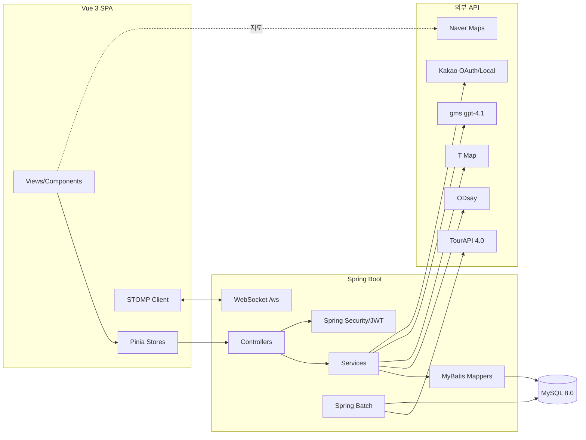

# 기타 참고 문서 — TripCraft (v2)

> 기술 스택 · 시스템 구조도 · 외부 API 연동 · 코딩 컨벤션 · 핵심 알고리즘을 한 문서로 정리.
>
> **v2 교정**(원본 `기타참고문서.md` 보존): ① 인증 흐름을 실제 구현(HttpOnly 쿠키 기반)에 맞게 수정 ② Git 플로우를 실제(GitLab·`master`·MR)로 정정 ③ 패키지명 `vuedraggable` 정확화.

---

## 1. 기술 스택

| Layer | 기술 |
|-------|------|
| Backend | Java 21 · Spring Boot 3.5.0 · Spring Security · Spring Batch · Spring AI · MyBatis · MySQL 8.0 · Gradle(Kotlin DSL) |
| Frontend | Vue.js 3 + Vite · Pinia · Vue Router · vuedraggable · Tiptap(에디터) |
| 인증 | JWT (Access 30분 + Refresh 7일) · BCrypt · Kakao OAuth |
| 실시간 | Spring WebSocket + STOMP + SockJS |
| 외부 API | 한국관광공사 TourAPI 4.0 · ODsay · T Map(SKT) · Naver Maps · Kakao Local · gms(OpenAI 호환 프록시, gpt-4.1) |

---

## 2. 시스템 구조도

- **인증 흐름**: 로그인 → `access_token`·`refresh_token`을 **HttpOnly 쿠키**로 발급 → `JwtAuthenticationFilter`가 매 요청 `access_token` 쿠키 검증 → 만료 시 `/api/auth/refresh`(refresh 쿠키)로 재발급.
- **공통 응답**: 모든 API는 `ApiResponse<T>` = `{ success, data, message, errorCode }`로 래핑.
- **권한**: 서버 측 소유권 검증(클라이언트 권한만으로 처리 금지). 관리자 기능은 `role=ADMIN` 검사.

---

## 3. 외부 API 연동

| API | 클라이언트/설정 | 용도 | 최적화 |
|-----|----------------|------|--------|
| **TourAPI 4.0** | `TourApiClient`, `TourApiSyncJobConfig`, `TourApiCallLimiter` | 관광지 master+상세 수집(areaBasedList2·detailCommon2 등) | 초기 일괄 배치 → 자체 DB 서비스, `api_modified_at` 증분 동기화, 호출 제한 |
| **ODsay** | `OdsayClient` | 대중교통 경로(searchPubTransPathT)·노선 폴리라인(loadLane) | 좌표 route_key + 모드별 `transit_cache`, 노선은 `lane_polyline` 영구 캐시 |
| **T Map(SKT)** | `TMapClient` | 자동차·도보 경로, 택시 예상요금, GeoJSON 좌표 | `transit_cache.route_coords/taxi_fare` 캐시 |
| **Naver Maps** | 프론트 SDK | 마커·InfoWindow·경로 폴리라인 시각화 | - |
| **Kakao** | `KakaoLocalClient` | OAuth 로그인 + Local 키워드 검색(커스텀 장소) | - |
| **gms (Spring AI)** | `ChatClientConfig` | 관광지 AI 챗봇(gpt-4.1) | InMemory ChatMemory 멀티턴, 회원 전용 |

모든 API 키는 환경변수로 주입(`TOUR_API_KEY`·`ODSAY_API_KEY`·`TMAP_API_KEY`·`KAKAO_*`·`GMS_KEY`) — 소스 하드코딩 금지.

---

## 4. 코딩 컨벤션 (요약)

- **Git**: GitLab MR 기반. `master` ← `feature/{도메인-기능}`·`fix/*`·`docs/*` (MR로 머지). `master` 직접 push 금지, 1회 이상 리뷰 후 머지.
- **커밋**: Conventional Commits — `feat(plan): 드래그 블록 시간표 추가`. 1커밋=1논리단위.
- **백엔드**: 도메인 중심 패키지, 클래스 PascalCase·메서드 camelCase·상수 UPPER_SNAKE·DB snake_case·URL kebab-case. REST 복수명사, 동사 URL 금지.
- **MyBatis**: `#{}` 바인딩만 사용 (`${}` 금지 — SQL Injection 방지).
- **프론트**: 컴포넌트 PascalCase, 뷰는 `~View.vue`, composable `useXxx`, `<script setup>` 순서 규약.
- **DB**: PK `id BIGINT AUTO_INCREMENT`, `created_at/updated_at`, 논리삭제 `deleted_at`, FK `참조단수_id`.

> 정본: `docs/03_dev/conventions.md`.

---

## 5. 핵심 알고리즘 & 적용 패턴

### 5.1 이동 시간 자동 계산 & 캐싱
- 블록 배치/이동/삭제 시 인접 두 장소 간 이동시간을 계산해 `TransitPill`로 삽입.
- 캐시 키 = **(좌표 route_key, departure_hour, request_mode)** → 모드별 독립 캐시(`transit_cache`).
- 캐시 정밀도는 `system_config`로 1~5단계 조정(시간무시 ~ 시간별). 러시아워 경계도 설정값으로 분기.
- 캐시 미스 시에만 ODsay/T Map 호출 → 무료 플랜 쿼터 보호. 노선 형상은 `lane_polyline` 영구 캐시.

### 5.2 드래그앤드롭 타임라인
- vuedraggable 기반. 후보군 → Day 타임라인 드롭 시 `trip_block` 생성, 체류시간 핸들로 30분 스냅.
- 같은 장소 중복 방문 허용, 사이드바 드롭으로 삭제. `display_order`로 날짜 내 순서 관리.
- 날짜 범위 이탈은 DB **TRIGGER**로 방어(`trg_trip_block_date_insert/update`).

### 5.3 실시간 협업 (낙관적 락)
- WebSocket(STOMP) `/topic/trip/{id}`로 변경 브로드캐스트, presence로 참가자·커서 동기화.
- 동시 편집 충돌은 `trip_block.version` 낙관적 락 — 사용자 편집 시 +1, 후행 저장은 version 불일치로 거부 후 재동기화. (transit 재계산은 version 미변경)

### 5.4 AI 주변 추천
- 관광지 좌표 기준 반경 ~3km·최대 8곳을 `ST_Distance_Sphere`로 거리순 조회 → 시스템 프롬프트 컨텍스트 주입.
- gms gpt-4.1 멀티턴 응답에서 실제 언급된 장소만 버튼화 → 지도 핀·상세 이동, 뒤로가기 시 대화·스크롤 복원.

### 5.5 데이터 보존 정책 (삭제 전략)
- 작성자/일정 삭제 시 게시글·공지 **SET NULL** 보존("탈퇴한 사용자").
- 후보군→블록 **RESTRICT**로 모달 확인 UX. 글 **소프트 딜리트**(`deleted_at`) + 북마크 보존.
