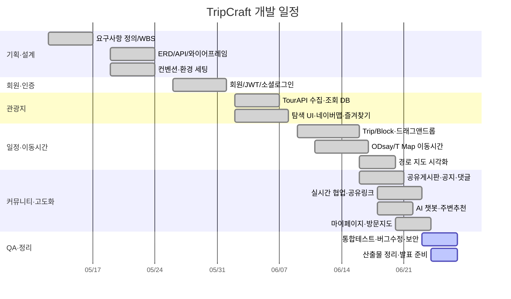
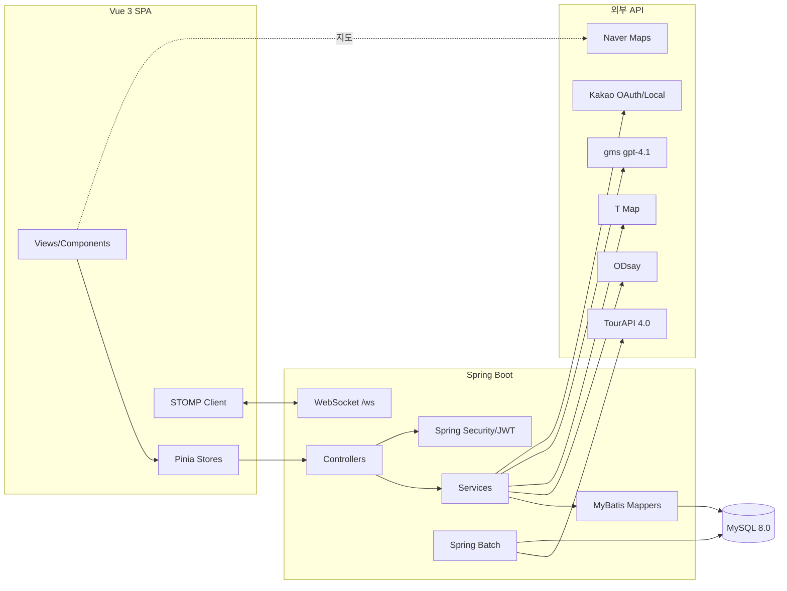
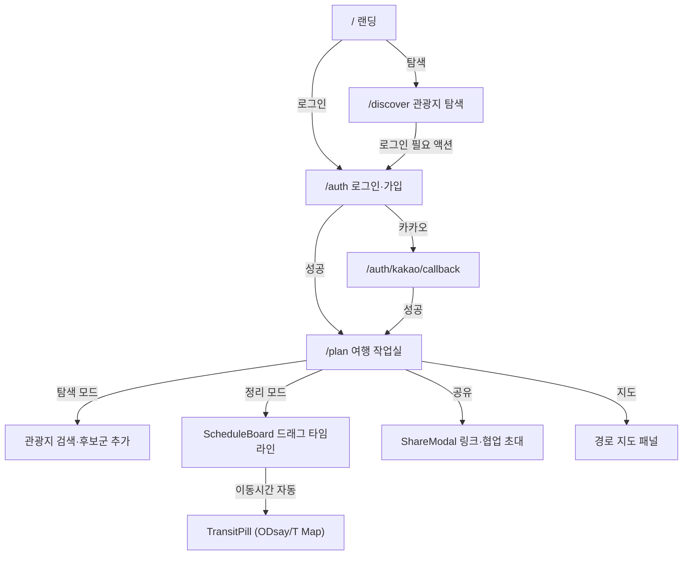
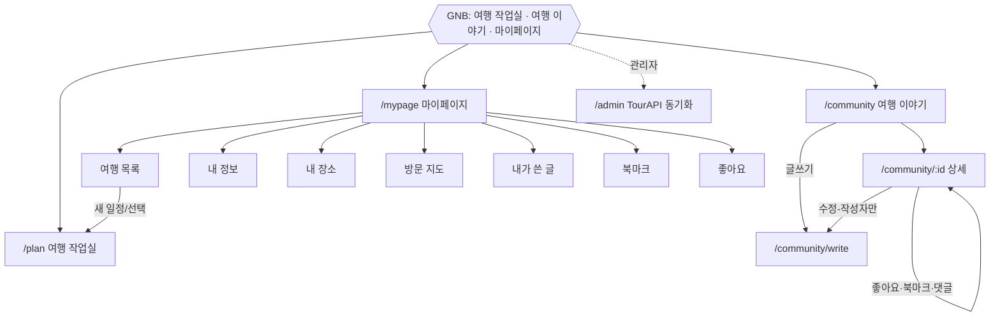
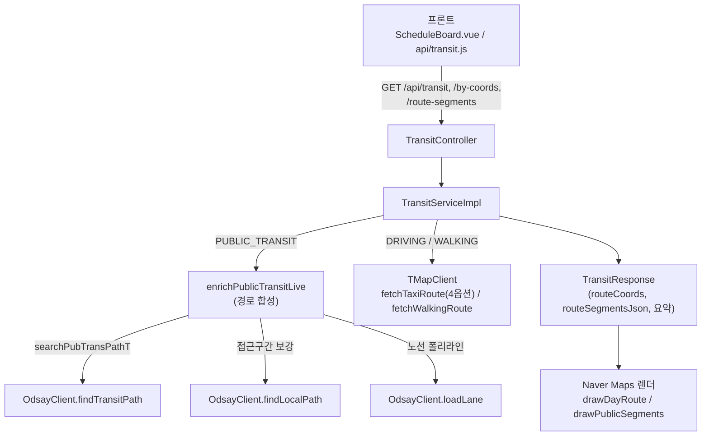
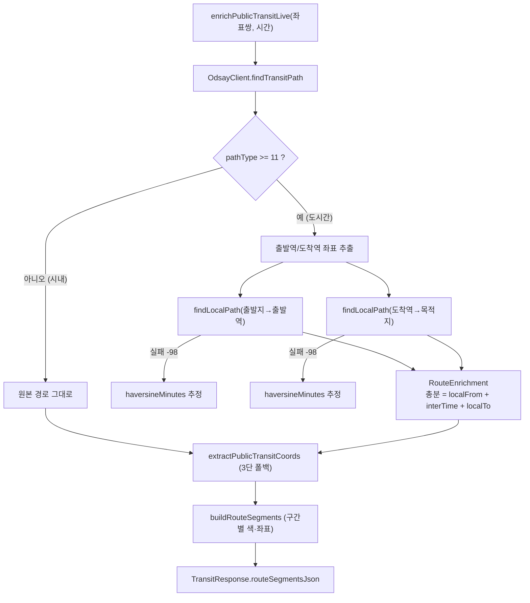
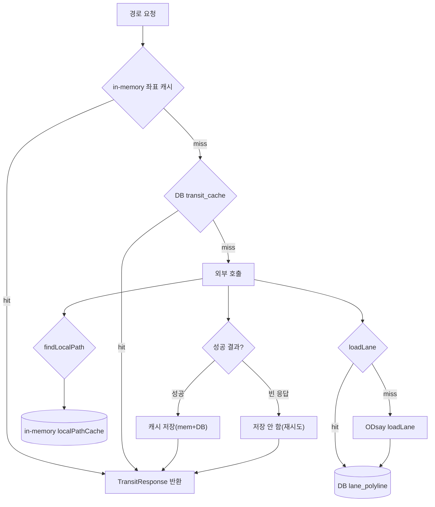
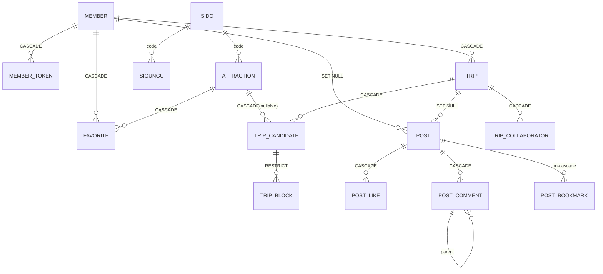
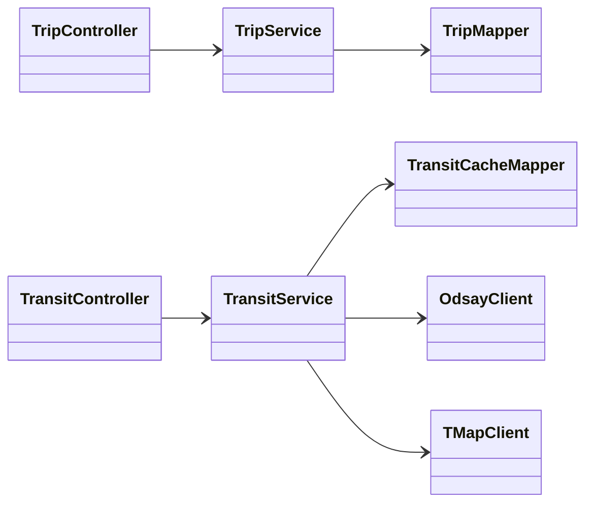
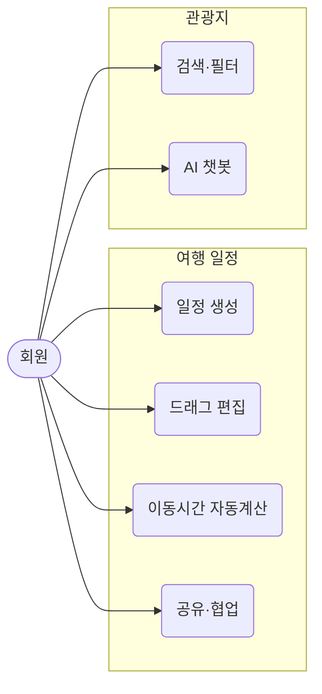

<!--
  TripCraft 발표 덱 — "범용 PPT 생성 AI(Gamma 등)" 에 붙여넣을 프롬프트.
  이 파일 전체를 복사해 PPT 생성 AI에 입력하면 ~50장 발표 슬라이드가 만들어진다.
  Mermaid/와이어프레임은 docs/06_submission/설계문서/ 에서 PNG로 내보내 해당 슬라이드에 삽입.
-->

# [프롬프트] TripCraft 최종 발표 슬라이드 생성 요청

너는 전문 발표자료 디자이너다. 아래 사양대로 **한국어 발표 슬라이드 덱(약 50장)** 을 만들어라.

## 전역 지침
- **언어**: 한국어. **비율**: 16:9. **분량**: 50장(±2).
- **톤**: 개발 프로젝트 최종 발표(심사위원 대상). 전문적·간결, 한 슬라이드 한 메시지.
- **테마**: 주조색 보라 `#6d28d9`, 보조 그레이/화이트. 제목은 보라, 본문은 진회색. 깔끔한 카드/표 스타일.
- **레이아웃 규칙**: 각 슬라이드는 ① 제목 ② 본문(불릿 3~6개 또는 표) ③ 비주얼(다이어그램/아이콘/이미지) 중심으로. 텍스트 과밀 금지.
- **섹션 디바이더**: 각 대단원 시작에 보라 배경 디바이더 슬라이드.
- **다이어그램**: 각 슬라이드에 **Mermaid 원문이 인라인으로 포함**돼 있다. Mermaid 렌더를 지원하면 그대로 렌더하고, 미지원이면 그 코드 블록을 이미지로 변환해 삽입한다. 표는 그대로 표로 렌더.
- **placeholder**: `🖼[…]` 로 표시된 로고·팀사진·회고·시연영상·캡처 자리만 빈 자리표시 박스로 둔다(텍스트만으로 완결되며, 추가 이미지 export 불필요).

---

## 슬라이드 사양 (1~50)

### Slide 1 — 표지
- 레이아웃: 표지(센터)
- 내용: 큰 타이틀 **TripCraft**, 부제 "여행을 설계하는 가장 스마트한 방법 — 탐색부터 일정·이동시간·협업·공유까지", 팀원 **전진 · 송정기**, 기간 **2026.05 ~ 2026.06 (약 6주)**
- 비주얼: 🖼[로고/히어로 이미지]

### Slide 2 — 목차 (Agenda)
- 레이아웃: 불릿(2열)
- 내용: 1.기획 배경·목표 / 2.추진 계획 / 3.시장 분석 / 4.개발 결과 / 5.개발 환경·시스템 구조 / 6.화면 흐름도·시연 / 7.적용 패턴·핵심 알고리즘 / 8.기대 효과 / 9.개발 후기 / 부록 A·B

### Slide 3 — [디바이더] 1. 기획 배경 · 목표

### Slide 4 — 문제 인식
- 레이아웃: 불릿 + 아이콘
- 내용: 국내 여행 계획 시 **최소 4~5개 서비스를 동시에** 사용 — 관광지는 포털 지도, 운영시간·예약은 개별 사이트, 이동수단·소요시간은 대중교통 앱, 숙소는 예약 플랫폼, 일행 조율은 메신저·노션. → "여행 계획 세우기" 자체가 피로한 작업이 되고, 현장에서 이동시간이 어긋나면 동선이 무너진다.

### Slide 5 — 핵심 불편함
- 레이아웃: 표
- 표:
  | 불편 | 내용 |
  |------|------|
  | 정보의 분산 | 관광지·이동·숙소가 서로 다른 서비스에 흩어져 통합 뷰 없음 |
  | 수동 이동시간 계산 | 장소가 바뀔 때마다 직접 검색해 수기 반영 |
  | 일정의 경직성 | 시간·장소를 옮겨도 자동 재배치·재계산 도구 부재 |
  | 협업의 불편함 | 범용 도구는 여행 일정 특유의 시간·장소 구조 표현·실시간 논의에 부적합 |

### Slide 6 — 목표: "한 화면에서 끝나는 여행 일정 도구"
- 레이아웃: 표(핵심가치 4)
- 내용: 탐색 → 후보군 → **드래그앤드롭 일정 확정** → 구간 이동시간 자동 계산 → 커뮤니티 공유를 한 흐름으로, 일행과 실시간 편집.
- 표:
  | 핵심 가치 | 설명 |
  |------|------|
  | 통합 | 탐색–후보군–타임라인–공유를 한 플로우로 |
  | 자동화 | 장소 추가 시 도시 분류·이동시간·경로 연동 자동 |
  | 유연성 | 후보군 먼저, 날짜·시간은 나중에 정하는 2단계 계획 |
  | 협업 | 여행 특화 UI로 일행과 실시간 공동 편집 |

### Slide 7 — 추가·차별화 기능
- 레이아웃: 불릿(4 카드)
- 내용: **실시간 공동 편집**(WebSocket/STOMP + 낙관적 락 + 상대 커서) · **멀티모달 이동시간**(ODsay 대중교통 + T Map 자동차·도보·택시요금, 구간별 모드, 경로 지도 시각화) · **관광지 AI 챗봇**(Spring AI 컨텍스트 Q&A + 반경 3km 주변 추천) · **공유 링크/커뮤니티**(VIEW·EDIT 공유, 게시판 공유, 방문 지도)

### Slide 8 — 목표 사용자
- 레이아웃: 불릿(3 페르소나)
- 내용: 국내 여행을 직접 설계하는 **자유여행 선호자** · 2인 이상 함께 계획하는 **소그룹 여행자** · 촘촘한 일정보다 유연한 플로우를 선호하되 **기본 동선은 미리 잡고 싶은** 여행자

### Slide 9 — [디바이더] 2. 추진 계획

### Slide 10 — 전체 일정 요약
- 레이아웃: 표
- 표:
  | 단계 | 기간 | 주요 내용 |
  |------|------|-----------|
  | 1 기획 | Week 1 | 요구사항·WBS·협업 환경 |
  | 2 설계 | Week 2 | ERD·API·와이어프레임·컨벤션 |
  | 3 개발 | Week 3~5 | 회원 → 관광지·즐겨찾기 → 일정·이동시간 |
  | 4 커뮤니티·고도화 | Week 6~ | 공유게시판·공지, 협업·공유링크, AI 챗봇, 마이페이지 |
  | 5 QA·정리 | 막바지 | 통합 테스트·버그·보안·산출물 |

### Slide 11 — 간트 차트
- 레이아웃: 다이어그램(전폭)
- 비주얼(아래 Mermaid 그대로 렌더):


### Slide 12 — 마일스톤
- 레이아웃: 표
- 표:
  | 마일스톤 | 목표 | 완료 기준 | 상태 |
  |----------|------|-----------|------|
  | M1 설계 완료 | W2 | ERD·API·와이어프레임 확정 | ✅ |
  | M2 회원+관광지 | W4 | 로그인·관광지 조회·즐겨찾기 | ✅ |
  | M3 일정 기능 | W5 | 드래그 타임라인·이동시간·저장 | ✅ |
  | M4 MVP+고도화 | W6 | 커뮤니티·협업·AI·마이페이지 | ✅ |
  | M5 제출 | 막바지 | QA·산출물·발표 준비 | ✅ |

### Slide 13 — 개인별 분담
- 레이아웃: 표
- 표:
  | 주차 | 전진 | 송정기 |
  |------|------|--------|
  | W1~2 | 요구사항·유스케이스·API 명세 | ERD·스키마·컨벤션·환경 |
  | W3 | 회원·JWT·Spring Security | 관광지 TourAPI 수집·조회 |
  | W4 | 커뮤니티 게시판 | 후보군 자동연동·탐색 UI·네이버맵 |
  | W5 | 마이페이지·드래그앤드롭 | 타임라인·이동시간(ODsay/T Map)·경로 시각화 |
  | W6~ | 실시간 협업 | 공유링크·AI 챗봇 |
- 발표노트: 핵심 화면(일정 편집)·협업은 공동 작업, 세부 분담은 Git/MR 이력 기준.

### Slide 14 — 리스크 & 대응
- 레이아웃: 표
- 표:
  | 리스크 | 대응 |
  |--------|------|
  | TourAPI 할당량 초과 | 초기 일괄 적재 후 자체 DB, call limiter |
  | ODsay/T Map 지연·쿼터 | 좌표 기반 모드별 캐시 + 노선 폴리라인 영구 캐시 |
  | 드래그앤드롭 복잡도 | vuedraggable 활용 |
  | 동시 편집 충돌 | `version` 낙관적 락으로 후행 저장 거부·재동기화 |
  | 2인 일정 지연 | 주 1회 동기화·우선순위 재조정 |

### Slide 15 — 경쟁 서비스 비교
- 레이아웃: 표(강조 열 = TripCraft)
- 내용: 기존 서비스는 "탐색"·"길찾기"는 잘하지만 **여러 장소를 하루 동선으로 엮고 구간 이동시간을 자동 반영하며 일행과 함께 편집**하는 흐름은 비어 있다.
- 표:
  | 항목 | 네이버 여행 | 구글 지도 | 트리플 | TripCraft |
  |------|:--:|:--:|:--:|:--:|
  | 관광지 탐색 | ◯ | ◯ | ◯ | ◯ |
  | 드래그앤드롭 일정 | △ | ✕ | △ | ◎ |
  | 구간 이동시간 자동 | ✕ | ◯ | △ | ◎ |
  | 이동수단 구간별 선택 | ✕ | △ | ✕ | ◎ |
  | 실시간 공동 편집 | ✕ | ✕ | ✕ | ◎ |
  | AI 관광 챗봇 | ✕ | ✕ | △ | ◎ |
  | 일정 커뮤니티 공유 | △ | ✕ | ◯ | ◯ |
- 발표노트: ◎강점 ◯지원 △부분 ✕미지원. 핵심 공백 = 드래그 일정 + 구간별 이동수단 + 실시간 편집.

### Slide 16 — 차별화 전략
- 레이아웃: 불릿(5)
- 내용: **통합 동선 설계**(한 작업실에서 전환 비용 제거) · **현실적 이동시간**(ODsay+T Map 구간별 모드) · **협업 우선**(공유 링크 + 실시간 동시 편집) · **AI 도우미**(컨텍스트 Q&A + 주변 추천) · **기록의 자산화**(커뮤니티 공유 + 방문 지도)

### Slide 17 — [디바이더] 4. 개발 결과 — 핵심 기술·구현

### Slide 18 — 회원·인증
- 레이아웃: 불릿
- 내용: Spring Security + JWT(Access 30분 / Refresh 7일), **HttpOnly 쿠키** 발급·검증, 토큰 자동 재발급, BCrypt 해시, **Kakao OAuth** 소셜 로그인, 회원가입/수정/탈퇴.

### Slide 19 — 관광지 (TourAPI·지도)
- 레이아웃: 불릿
- 내용: 한국관광공사 **TourAPI 4.0** 전국 데이터 일괄 수집 → 자체 DB 서비스(`api_modified_at` 증분 동기화). 지역·카테고리·키워드 조회, 상세(소개·이미지·이용안내), **Naver Maps** 마커·InfoWindow 연동, 즐겨찾기.

### Slide 20 — 일정·드래그앤드롭
- 레이아웃: 불릿
- 내용: Trip → Candidate → Block 모델. **vuedraggable** 드래그앤드롭 타임라인(Day 탭, 30분 스냅, 사이드바 삭제존). 후보군 도시(시군구) 자동 분류, 즐겨찾기 자동 연동, 중복 방문 허용. 날짜 범위 이탈은 DB TRIGGER로 방어.

### Slide 21 — 이동시간·경로 시각화
- 레이아웃: 불릿 + 작은 지도 이미지
- 내용: ODsay(대중교통)·T Map(자동차·도보) 연동, **구간별 모드**(대중교통/자동차/도보) + 택시요금, 좌표 기반 모드별 캐시. 대중교통 노선 폴리라인 + 환승/도보 구간 + 역 마커 시각화.
- 비주얼: 🖼[경로 지도 스크린샷] (선택)

### Slide 22 — 협업·커뮤니티
- 레이아웃: 불릿
- 내용: **WebSocket(STOMP)** 실시간 협업 + 공유 링크(VIEW/EDIT). 게시판(작성/목록/상세/수정/삭제, 소프트 딜리트)·공지·댓글/대댓글·좋아요·북마크, 방문 지도.

### Slide 23 — AI 챗봇·마이페이지
- 레이아웃: 불릿
- 내용: **Spring AI + gms(gpt-4.1)** 관광지 컨텍스트 Q&A(멀티턴) + 반경 3km 주변 추천(언급 장소 핀 이동). 마이페이지 7탭(여행·내정보·내장소·방문지도·내가쓴글·북마크·좋아요).

### Slide 24 — [디바이더] 5. 개발 환경 & 시스템 구조도

### Slide 25 — 기술 스택
- 레이아웃: 표
- 표:
  | Layer | 기술 |
  |-------|------|
  | Backend | Java 21 · Spring Boot 3.5 · Spring Security/Batch/AI · MyBatis · MySQL 8 · Gradle |
  | Frontend | Vue 3 + Vite · Pinia · Vue Router · vuedraggable · Tiptap |
  | 인증 | JWT(30분/7일) · BCrypt · Kakao OAuth |
  | 실시간 | WebSocket + STOMP + SockJS |
  | 외부 API | TourAPI · ODsay · T Map · Naver Maps · Kakao · gms(gpt-4.1) |

### Slide 26 — 전체 시스템 구조도
- 레이아웃: 다이어그램(전폭)
- 비주얼(아래 Mermaid 그대로 렌더):


### Slide 27 — 인증 흐름·공통 응답·보안
- 레이아웃: 불릿
- 내용: 로그인 → `access_token`·`refresh_token` **HttpOnly 쿠키** → `JwtAuthenticationFilter` 매 요청 검증 → 만료 시 `/api/auth/refresh`. 공통 응답 `ApiResponse{success,data,message,errorCode}`. 서버 측 소유권/역할 검증, MyBatis `#{}` 바인딩, API 키 환경변수 주입.

### Slide 28 — [디바이더] 6. 화면 흐름도 및 시연

### Slide 29 — 화면 흐름도 ① 진입·작업실
- 레이아웃: 다이어그램(전폭)
- 비주얼(아래 Mermaid 그대로 렌더):


### Slide 30 — 화면 흐름도 ② GNB·커뮤니티·마이페이지
- 레이아웃: 다이어그램(전폭)
- 비주얼(아래 Mermaid 그대로 렌더):


### Slide 31 — 핵심 5화면 와이어프레임
- 레이아웃: 이미지 그리드(2~3열)
- 비주얼: `[이미지 삽입: 설계문서/wireframes/screen-M/A/B/C/D.svg]` (일정 생성 모달·관광지 탐색·작업실·커뮤니티·로그인)

### Slide 32 — 🎬 시연 영상
- 레이아웃: 영상(전폭)
- 비주얼: 🖼[시연 영상 임베드/링크 placeholder] — 약 3분 녹화 데모
- 발표노트(영상 흐름 요약): ① 랜딩 → ② 카카오 로그인 → ③ 관광지 탐색 → ④ 상세·AI 챗봇·담기 → ⑤ 드래그 일정·지도·이동수단·내 장소 → ⑥ 실시간 협업·공유(읽기전용 링크) → ⑦ 여행 이야기·그대로 가져오기 → ⑧ 글쓰기·수정 → ⑨ 방문 지도(시도/시군구) → ⑩ 마이페이지 관리 → ⑪ 클로징

### Slide 33 — [디바이더] 7. 적용 패턴 및 핵심 알고리즘

### Slide 34 — [경로] 왜 무료 API 조합인가
- 레이아웃: 표 + 한 줄 메시지
- 내용: 유료 길찾기 API(Kakao Mobility) 한 호출이면 끝나지만 **비용 회피**를 위해 무료 조합(ODsay+T Map+Naver) 선택 → 대가로 합성·파싱과 호출제한 대응을 직접 설계.
- 표:
  | 접근 | API | 비용 | 기술 부담 |
  |------|-----|------|----------|
  | 유료 단일 | Kakao Mobility 길찾기 | 호출당 과금 | 거의 없음 |
  | 무료 조합(채택) | ODsay+T Map+Naver | 무료 | 응답 직접 합성·파싱 + 캐시로 호출제한 방어 |

### Slide 35 — [경로] API 오케스트레이션 전체 그림
- 레이아웃: 다이어그램(전폭)
- 비주얼(아래 Mermaid 그대로 렌더):

- 발표노트: 도시간 경로는 "역→역"만 줘서 접근 구간을 추가 호출로 합성, 지도 선은 loadLane 별도 호출.

### Slide 36 — [경로] 경로 합성·보강 (조립)
- 레이아웃: 다이어그램(전폭)
- 비주얼(아래 Mermaid 그대로 렌더):

- 발표노트: `[출발지→역]+[KTX]+[역→목적지]` 합성, 실패 시 하버사인 추정 폴백, 3단 폴리라인 폴백.

### Slide 37 — [경로] 다층 캐싱 (핵심)
- 레이아웃: 다이어그램 + 표
- 비주얼(아래 Mermaid 그대로 렌더):

- 표(핵심만):
  | 계층 | 저장소 | 대상 |
  |------|--------|------|
  | 이동시간 | DB transit_cache | 관광지쌍 경로 |
  | 노선 형상 | DB lane_polyline | loadLane 결과(영구) |
  | 좌표 결과 | in-memory | 커스텀 장소, 성공만 저장 |
  | 로컬 경로 | in-memory | 보강 중복 제거 |
- 발표노트: 무료 API는 같은 좌표 반복 시 빈 응답(8연타 실험) → 성공만 캐시.

### Slide 38 — 드래그 타임라인
- 레이아웃: 불릿
- 내용: 후보군 → Day 그리드 드롭으로 블록 생성, **30분 스냅**, 사이드바 삭제존, `display_order`로 날짜 내 순서. 날짜 범위 이탈은 DB **TRIGGER**로 방어. 중복 방문 허용.

### Slide 39 — [협업] 2채널 분리 설계
- 레이아웃: 다이어그램/불릿
- 내용: **편집(영속)**=REST + DB 트랜잭션 + 낙관적 락 → STOMP "변경됨" broadcast. **presence(커서·휘발)**=DB 없이 in-memory(ConcurrentHashMap), 고빈도라 가볍게. 서로 다른 요구를 각각 최적화.
- 비주얼(아래 도식 그대로):
```
[사용자 A]                 [Spring 서버]                 [사용자 B]
 드래그 ──REST──▶ TripServiceImpl(@Transactional)
                    ├ 낙관적 락(version)·grab·겹침 검사
                    ├ DB 반영
                    └ broadcast(TripEvent, seq) ──STOMP──▶ /topic/trip/{id} ─▶ loadTrip
 마우스 이동 ──STOMP──▶ /app/trip/{id}/pointer
                    TripPresenceController(in-memory)
                    └ broadcastPresence ──STOMP──▶ /topic/trip/{id}/presence ─▶ 좌표 역환산·커서 렌더
```

### Slide 40 — [협업] WebSocket(STOMP) 실시간 적용
- 레이아웃: 불릿
- 내용: 폴링·SSE 대비 **양방향·저지연** WebSocket 채택, STOMP로 토픽 pub/sub·채널 분리(`/topic/trip/{id}`, `/presence`), SockJS 폴백. 쿠키 핸드셰이크 인증 + 권한 캐시(`TripAccessVersion`). seq로 순서·중복 방어, afterCommit으로 외부 재계산 분리.

### Slide 41 — [협업] 낙관적 락 충돌 매트릭스
- 레이아웃: 표
- 내용: `trip_block.version` 조건부 UPDATE → 0행이면 409 → 재조회·재시도.
- 표:
  | 시나리오 | 메커니즘 | 결과 |
  |---|---|---|
  | 같은 블록 동시 이동 | version | 둘째 409 |
  | 드래그 중 타인 수정 | grab 게이트 | 즉시 409 |
  | 서로 다른 블록 | 독립 version | 충돌 없음 |
  | transit 재계산 ↔ 편집 | version 불변 UPDATE | 충돌 없음 |
  | 같은 시간대 겹침 | trip 행 FOR UPDATE | 둘째 409 |
- 발표노트: version은 같은 row에만 작용 → 무관 편집·재계산은 오탐 없음.

### Slide 42 — [협업] 상대 좌표 커서 동기화
- 레이아웃: 불릿
- 내용: 절대 픽셀은 창 크기·스크롤·패널 폭이 달라 엉뚱한 곳에 찍힘 → **zone + 의미 좌표**(timetable: dayIndex+colRatioX+contentY)로 송수신, 수신측이 자기 DOM 기준 역환산. 적응형 throttle(AIMD)·보간으로 백로그 제거.

### Slide 43 — AI 주변 추천 + 데이터 보존 정책
- 레이아웃: 2분할 불릿
- 내용: **AI 주변 추천** — `ST_Distance_Sphere`로 반경 3km 거리순 8곳 조회 → 프롬프트 주입, 응답 언급 장소만 버튼화·핀 이동, 뒤로가기 복원. **데이터 보존** — 작성자/일정 삭제 시 게시글·공지 SET NULL 보존("탈퇴한 사용자"), 후보군→블록 RESTRICT(모달 확인), 글 소프트 딜리트 + 북마크 보존.

### Slide 44 — 기대 효과
- 레이아웃: 불릿(5)
- 내용: **여행 준비 시간 단축**(앱 전환 비용 제거) · **현실적 일정**(구간별 실제 이동시간) · **함께 만드는 여행**(실시간 협업·공유) · **경험의 축적**(여행 이야기·방문 지도) · **확장성**(도메인 중심 설계 + 캐시 전략)

### Slide 45 — 개발 후기: 팀
- 레이아웃: 이미지 + 짧은 글
- 비주얼: 🖼[팀 사진 placeholder]
- 내용: 🖊[팀 한 줄 소감 placeholder]

### Slide 46 — 개발 후기: 개인 회고
- 레이아웃: 2분할
- 내용: 🖊[전진 회고 placeholder] / 🖊[송정기 회고 placeholder] — 배운 점·어려웠던 점·다음에 시도할 것

### Slide 47 — 부록 A. AI 사용 보고서
- 레이아웃: 불릿
- 내용: 기획·문서·코드 보조에 AI 활용 요약. 🖼[상세는 ai-report/AI사용보고서.md]

### Slide 48 — 부록 B①. ER 다이어그램
- 레이아웃: 다이어그램(전폭)
- 비주얼(아래 Mermaid 그대로 렌더 — 핵심 관계만; 상세 컬럼은 설계문서/04 참조):


### Slide 49 — 부록 B②. 클래스·유스케이스·API
- 레이아웃: 다이어그램/요약
- 내용: API 명세 요약 — REST 약 72개 + WebSocket(STOMP) 실시간 협업 채널. 상세 클래스/도메인 모델은 설계문서/03 참조.
- 비주얼(아래 Mermaid 그대로 렌더 — 계층 일부 + 유스케이스 발췌):



### Slide 50 — 감사합니다
- 레이아웃: 클로징(센터)
- 내용: **TripCraft** — 계획부터 공유까지 함께하는 여행 플래너 / 전진 · 송정기 / 감사합니다.
