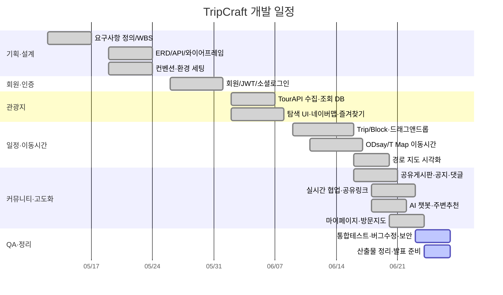
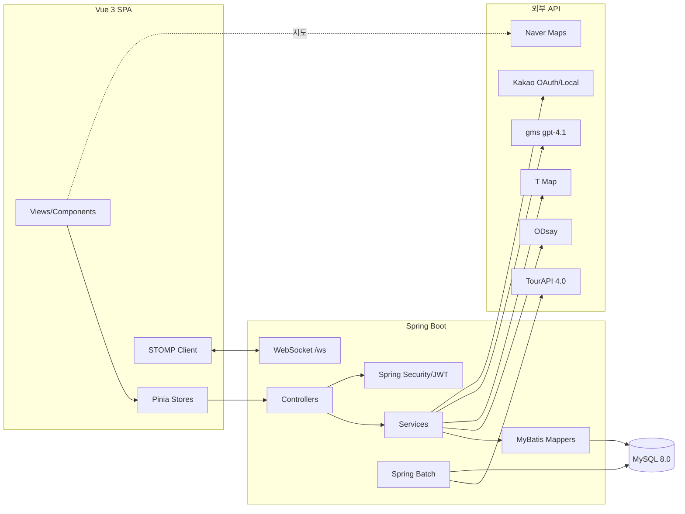
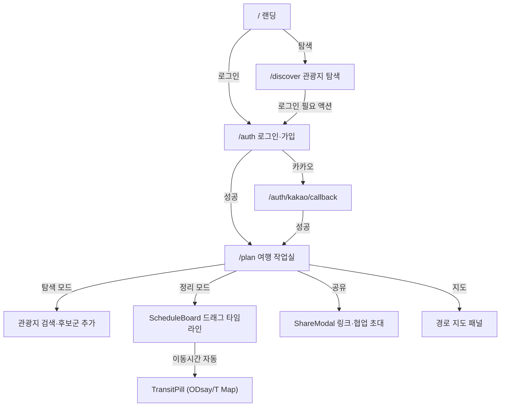
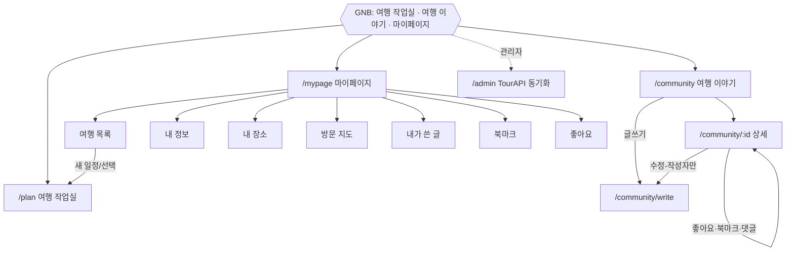
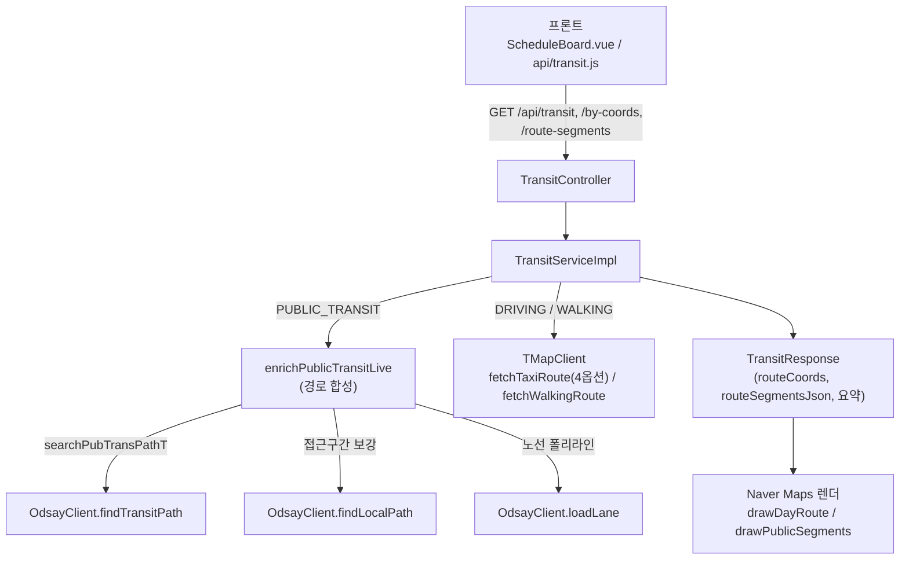
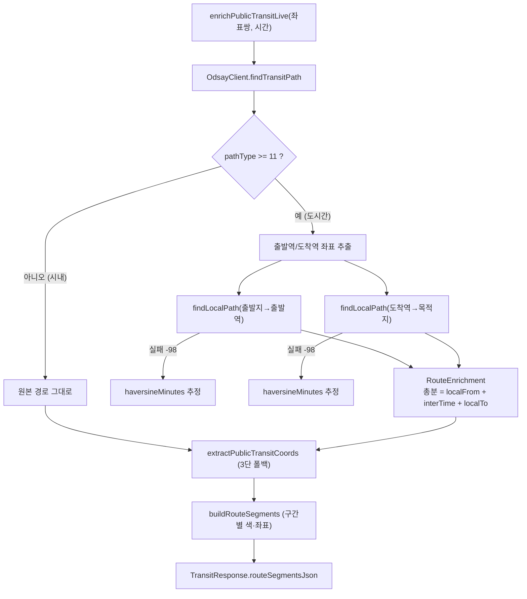
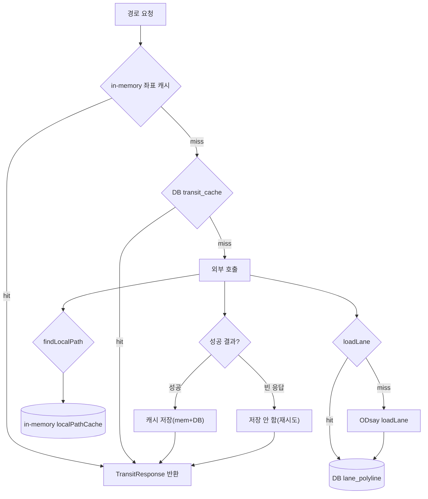
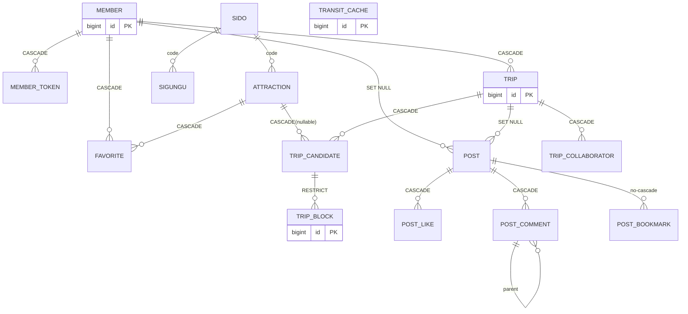
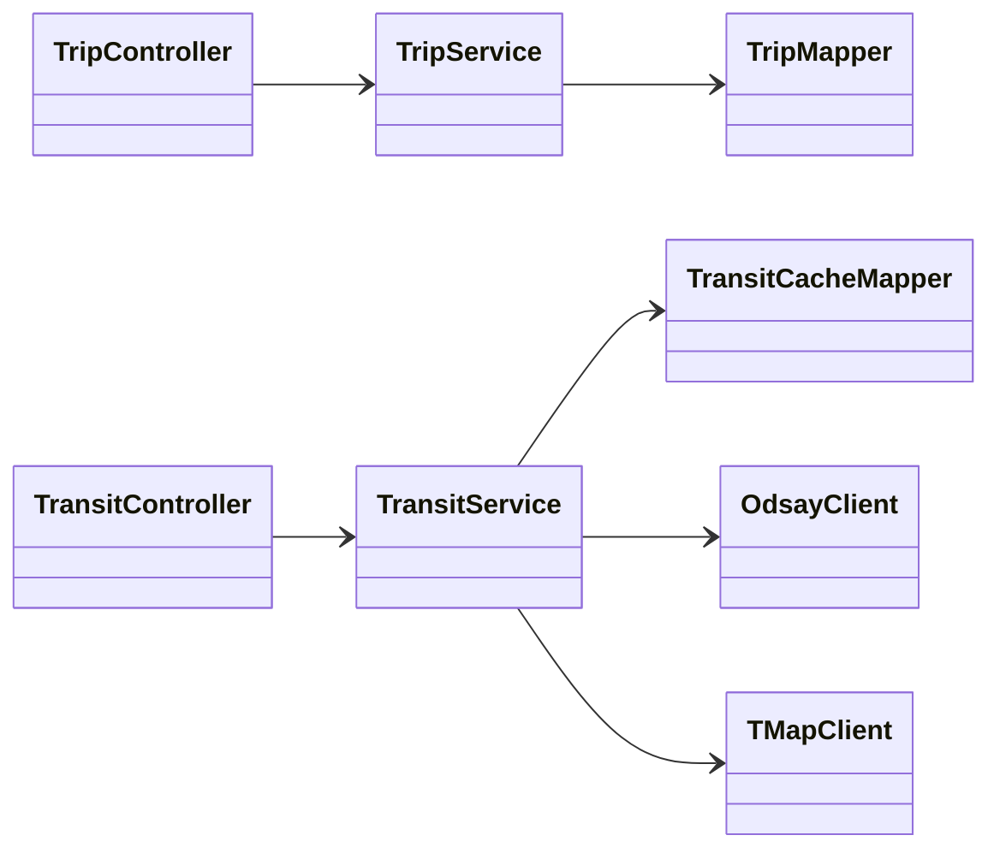
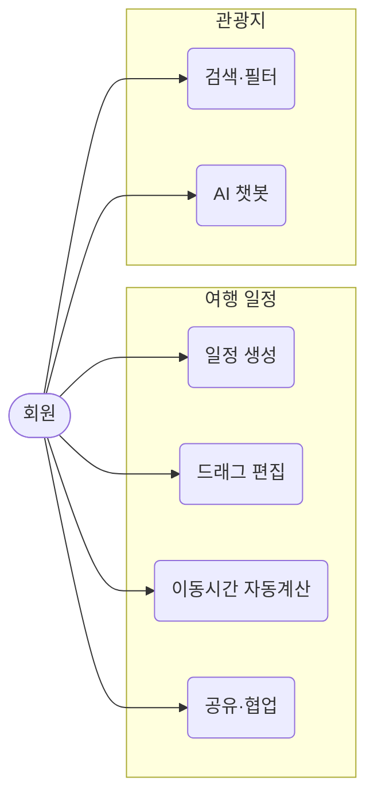

<!--
  TripCraft 발표 덱 — "Claude(디자인)" 에 붙여넣어 디자인된 슬라이드 아티팩트를 생성하는 프롬프트.
  이 파일 전체를 복사해 Claude에 입력하면, 발표용으로 바로 쓸 수 있는 HTML 슬라이드 덱이 만들어진다.
  파일 하단에 슬라이드가 참조하는 Mermaid 원본을 모두 첨부했다(Claude가 직접 렌더).
-->

# [프롬프트] TripCraft 발표 슬라이드 덱을 "디자인까지 입혀" 만들어줘

너는 시니어 프레젠테이션 디자이너이자 프론트엔드 개발자다.
아래 사양으로 **발표장에서 바로 띄울 수 있는, 디자인이 완성된 슬라이드 덱**을 만들어라.

## 출력 형식
- **단일 HTML 파일**(자기완결). CSS는 `<style>`에 인라인, 외부 폰트/아이콘/`mermaid.js`만 CDN 허용.
- **16:9**, 한 화면 = 한 슬라이드. 좌우 화살표·스페이스로 넘기는 네비게이션(reveal.js 또는 CSS scroll-snap 자유 선택).
- 약 **50장**. 각 슬라이드 우하단에 페이지 번호, 좌하단에 `TripCraft` 워드마크.
- **Mermaid 다이어그램은 네가 직접 렌더**한다(하단 첨부 코드 사용). 표·콜아웃은 스타일된 HTML 컴포넌트로.

## 디자인 시스템 (반드시 적용)
- **컬러**: 주조 보라 `#6d28d9`, 진보라 `#4c1d95`, 강조 `#a78bfa`, 배경 `#ffffff`/`#faf9ff`, 텍스트 `#1f2937`, 보조텍스트 `#6b7280`, 보더 `#e5e7eb`. 강조 포인트(차별점·핵심)는 보라 배지/하이라이트.
- **타이포**: 한글 산세리프(Pretendard 권장). 슬라이드 제목 32~40px·700, 본문 18~22px, 캡션 14px. 줄간격 넉넉히.
- **레이아웃**: 좌측 상단 정렬 제목 + 얇은 보라 언더라인. 넉넉한 여백(슬라이드 패딩 48~64px). 한 슬라이드 한 메시지, 텍스트 과밀 금지.
- **컴포넌트**: 둥근 모서리(12px) 카드, 보라 헤더의 표, 좌측 보라 바 콜아웃, 다이어그램은 연보라 배경 컨테이너에 가운데 정렬·여백.
- **섹션 디바이더**: 보라 풀블리드 배경 + 흰 대형 섹션 번호·제목.
- **placeholder**: 로고·팀사진·회고·시연영상·경쟁사 캡처는 점선 테두리 + 가운데 안내문 박스로.
- 발표 톤: 개발 프로젝트 최종 발표(심사위원). 전문적·자신감 있게.

## 슬라이드 구성 (50장)

> 각 줄 = 한 슬라이드. `[D:라벨]` 은 하단 첨부 Mermaid를 렌더, `[IMG]` 는 placeholder 박스.

**도입**
1. 표지 — **TripCraft / "여행을 설계하는 가장 스마트한 방법"** / 전진·송정기 / 2026.05~06 / [IMG 로고]
2. 목차 — 1.기획 2.추진계획 3.시장분석 4.개발결과 5.환경·구조 6.화면·시연 7.핵심 알고리즘 8.기대효과 9.후기 + 부록

**§1 기획 배경·목표**
3. [디바이더] 1. 기획 배경·목표
4. 문제 인식 — 국내 여행 계획 시 **4~5개 서비스 동시 사용**(지도·예약·대중교통·숙소·메신저) → 계획 자체가 피로, 현장 이동시간 어긋나면 동선 붕괴
5. 핵심 불편함(표) — 정보의 분산 / 수동 이동시간 계산 / 일정의 경직성 / 협업의 불편함
6. 목표 "한 화면에서 끝나는 여행 일정 도구"(핵심가치 4 카드) — 통합·자동화·유연성·협업
7. 추가·차별화 기능(4 카드) — 실시간 공동편집 / 멀티모달 이동시간 / AI 챗봇 / 공유링크·커뮤니티
8. 목표 사용자(3 페르소나) — 자유여행 선호자 / 소그룹 여행자 / 기본 동선 미리 잡는 여행자

**§2 추진 계획**
9. [디바이더] 2. 추진 계획
10. 전체 일정 요약(표) — 기획W1 / 설계W2 / 개발W3~5 / 고도화W6~ / QA·정리
11. 간트 차트 — [D:gantt]
12. 마일스톤(표) — M1~M5(✅✅✅✅✅)
13. 개인별 분담(표) — 전진/송정기 주차별
14. 리스크 & 대응(표) — TourAPI 쿼터·외부 API 지연·드래그 복잡도·동시편집 충돌·일정 지연

**§3 시장 분석**
15. 경쟁 비교(표, TripCraft 강조열) — 네이버여행/구글지도/트리플 vs TripCraft
16. 차별화 전략(5) — 통합 동선·현실적 이동시간·협업 우선·AI 도우미·기록 자산화

**§4 개발 결과 — 핵심 기술·구현**
17. [디바이더] 4. 개발 결과
18. 회원·인증 — Spring Security+JWT(HttpOnly 쿠키)·토큰 재발급·BCrypt·Kakao OAuth
19. 관광지 — TourAPI 4.0 일괄수집→자체DB(증분), 지역·카테고리·키워드, 상세, Naver Maps
20. 일정·드래그앤드롭 — Trip→Candidate→Block, vuedraggable, 30분 스냅, 도시 자동분류, 중복 허용
21. 이동시간·경로 — ODsay+T Map 구간별 모드·택시요금, 모드별 캐시, 노선 폴리라인 시각화 [IMG 지도]
22. 협업·커뮤니티 — WebSocket(STOMP)·공유링크, 게시판·공지·댓글·좋아요·북마크·방문지도
23. AI 챗봇·마이페이지 — Spring AI gpt-4.1 컨텍스트 Q&A + 주변 3km 추천, 마이페이지 7탭

**§5 개발 환경 & 시스템 구조도**
24. [디바이더] 5. 개발 환경 & 시스템 구조
25. 기술 스택(표) — Backend/Frontend/인증/실시간/외부 API
26. 전체 시스템 구조도 — [D:arch]
27. 인증 흐름·공통 응답·보안 — HttpOnly 쿠키 JWT·`ApiResponse`·서버측 권한·`#{}`·키 환경변수

**§6 화면 흐름도 및 시연**
28. [디바이더] 6. 화면 흐름도 및 시연
29. 화면 흐름도 ① 진입·작업실 — [D:flow1]
30. 화면 흐름도 ② GNB·커뮤니티·마이페이지 — [D:flow2]
31. 핵심 5화면 와이어프레임 — [IMG 와이어프레임 5종 그리드]
32. 🎬 **시연 영상**(전폭) — [IMG 영상 임베드/링크] · 약 3분. 발표노트: 탐색→상세·챗봇·담기→드래그 일정·지도·이동수단·내장소→실시간 협업·읽기전용 공유→여행이야기·가져오기→글쓰기·수정→방문지도→마이페이지→클로징

**§7 적용 패턴 및 핵심 알고리즘 (기술 하이라이트)**
33. [디바이더] 7. 적용 패턴 및 핵심 알고리즘
34. [경로] 왜 무료 API 조합인가(표) — 유료 Kakao 길찾기 대비 무료 ODsay+T Map+Naver, 대가=직접 합성·캐시
35. [경로] API 오케스트레이션 전체 그림 — [D:route_api]
36. [경로] 경로 합성·보강(조립) — [D:route_build]
37. [경로] 다층 캐싱 3계층(+표) — [D:route_cache]
38. 드래그 타임라인 — 30분 스냅·삭제존·`display_order`, 날짜 이탈 DB TRIGGER 방어
39. [협업] 2채널 분리 — 편집(REST+트랜잭션+낙관적락→STOMP broadcast) vs presence(in-memory 고빈도)
40. [협업] WebSocket(STOMP) 실시간 — 폴링·SSE 대비 양방향, 토픽 pub/sub, 쿠키 인증·권한캐시, seq 순서방어
41. [협업] 낙관적 락 충돌 매트릭스(표) — version 조건부 UPDATE→409→재조회, 같은 row만 작용(오탐 없음)
42. [협업] 상대 좌표 커서 — 절대픽셀 대신 zone+의미좌표 역환산, 적응형 throttle로 백로그 제거
43. AI 주변추천 + 데이터 보존 — ST_Distance_Sphere 3km 추천 / SET NULL·RESTRICT·소프트딜리트

**§8~9 + 부록**
44. 기대 효과(5) — 준비시간 단축·현실적 일정·함께 만드는 여행·경험 축적·확장성
45. 개발 후기: 팀 — [IMG 팀 사진] + 한 줄 소감 placeholder
46. 개발 후기: 개인 회고 — 전진 / 송정기 placeholder(배운 점·어려움·다음 시도)
47. 부록 A. AI 사용 보고서(요약)
48. 부록 B①. ER 다이어그램 — [D:er] (도메인별)
49. 부록 B②. 클래스·유스케이스·API — [D:class] [D:usecase] + REST 약 72개 + WebSocket 채널
50. 감사합니다(클로징) — TripCraft / 전진·송정기

---

# 첨부: 다이어그램 Mermaid 원본 (네가 직접 렌더)

## [D:gantt] 간트 차트

## [D:arch] 전체 시스템 구조도

## [D:flow1] 화면 흐름도 ① 진입·작업실

## [D:flow2] 화면 흐름도 ② GNB·커뮤니티·마이페이지

## [D:route_api] 경로 API 오케스트레이션

## [D:route_build] 경로 합성·보강 (조립)

## [D:route_cache] 다층 캐싱 구조

## [D:er] ER 다이어그램 (도메인별 — 4개를 나란히 렌더)

> 상세 컬럼·삭제정책은 `설계문서/04_ER다이어그램.md` 참조(필요 시 4개 도메인 ERD로 분할 렌더).

## [D:class] 클래스 다이어그램 (계층 + 도메인 모델)

> 전체 도메인 모델은 `설계문서/03_클래스다이어그램.md` 참조.

## [D:usecase] 유스케이스 (액터-기능)

