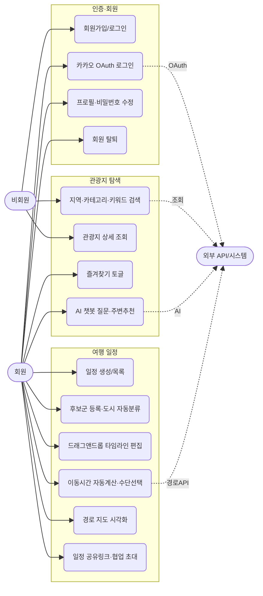
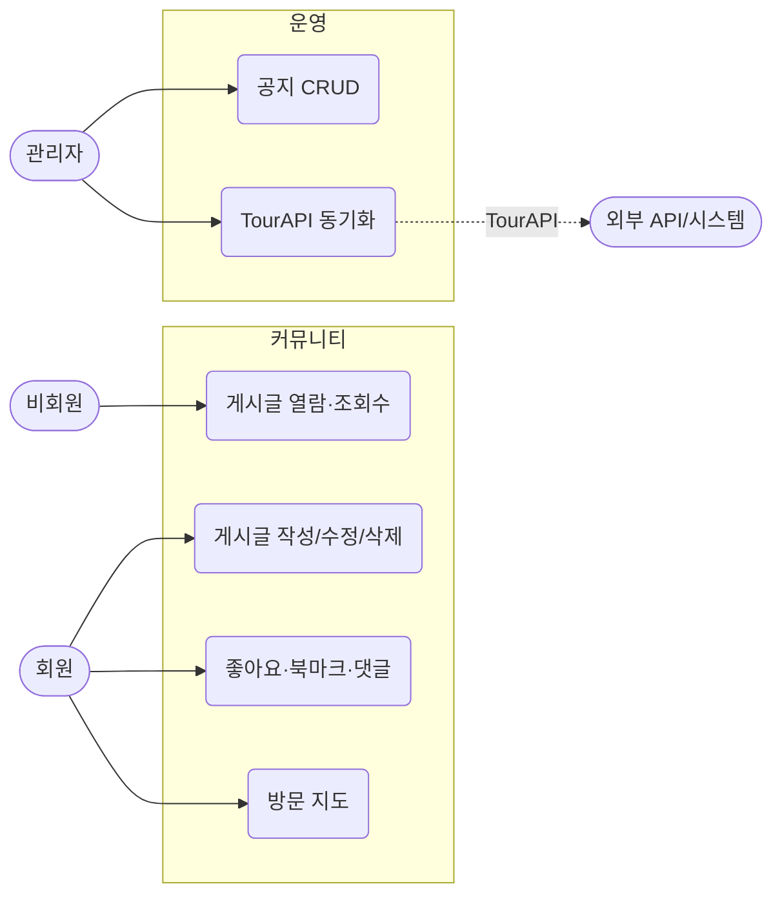

# Use-Case 다이어그램

> 액터별 유스케이스 정의와 유스케이스 다이어그램.

---

## 1. 액터 정의

| 액터 | 설명 | 권한 |
|------|------|------|
| **비회원 (Guest)** | 미로그인 방문자 | 관광지 조회, 커뮤니티/공지 열람, 공유 링크(VIEW) 조회 |
| **회원 (Member)** | 로그인 사용자 | Guest 권한 + 일정 CRUD·드래그 편집, 즐겨찾기, 후보군, 게시글/댓글/좋아요/북마크, AI 챗봇, 협업 |
| **관리자 (Admin)** | 운영자 | Member 권한 + 공지 CRUD, 게시글 관리, TourAPI 동기화 |
| **시스템/외부 API** | 배치·연동 주체 | TourAPI 수집, ODsay/T Map 경로 계산, Kakao OAuth/검색, gms(AI) 호출 |

---

## 2. 유스케이스 다이어그램

### 2-1. 회원 · 관광지 탐색 · 여행 일정

### 2-2. 커뮤니티 · 운영

---

## 3. 주요 유스케이스 명세 (요약)

| ID | 유스케이스 | 액터 | 사전조건 | 기본 흐름 |
|----|-----------|------|----------|-----------|
| UC10 | 후보군 등록 | 회원 | 활성 일정 존재 | 관광지 카드 "추가" → 후보군 등록 → 도시(시군구) 자동 그룹화 → 첫 등록 시 동일 도시 즐겨찾기 일괄 추가 |
| UC11 | 타임라인 편집 | 회원 | 후보군 ≥ 1 | CandidateCard를 Day 타임라인으로 드래그 → PlaceBlock 생성 → 체류시간 핸들 조정 → 자동 저장 |
| UC12 | 이동시간 계산 | 회원, 외부 | 블록 ≥ 2 | 블록 배치/이동/삭제 트리거 → 캐시 조회 → 미스 시 ODsay(대중교통)/T Map(자동차·도보) 호출 → TransitPill 삽입 |
| UC14 | 협업·공유 | 회원 | 일정 소유 | 공유 링크 발급(VIEW/EDIT) 또는 회원 검색 후 협업자(EDITOR/VIEWER) 초대 → WebSocket 실시간 동기화 |
| UC8 | AI 챗봇 | 회원, 외부 | 로그인 | 관광지 상세에서 질문 → 장소정보+반경3km 주변장소 컨텍스트 주입 → gms gpt-4.1 멀티턴 응답 → 언급 장소 핀 이동 |

> 전체 기능 요구사항(US-xx-xx, AC)은 요구사항 정의서를 참조.
