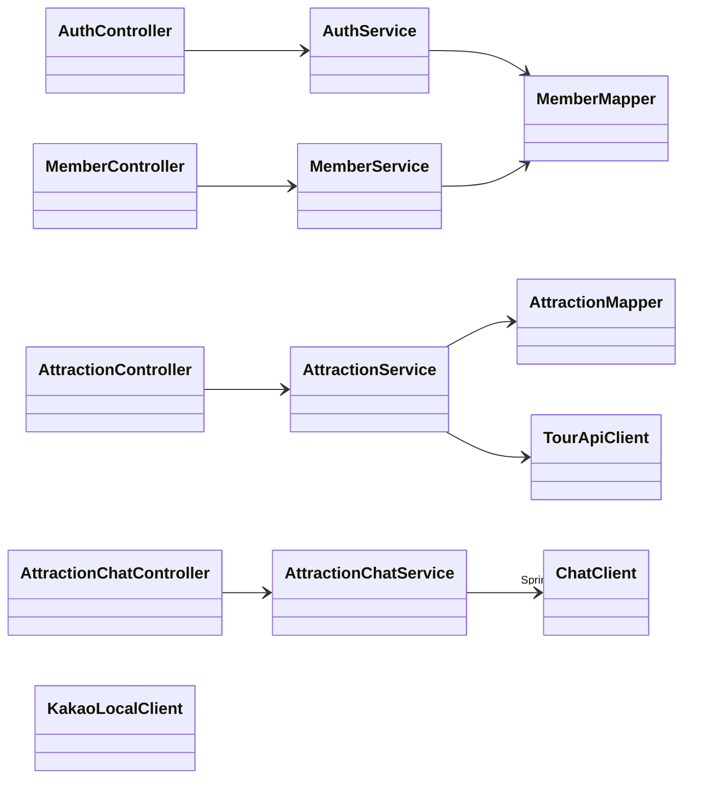
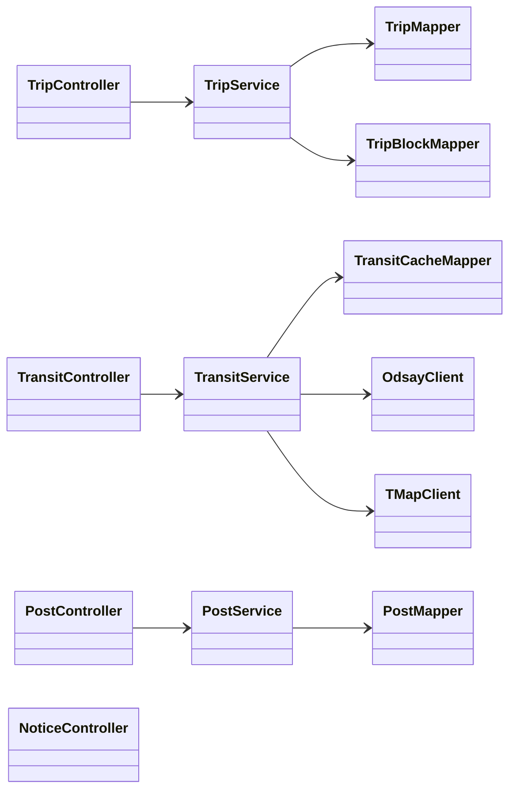
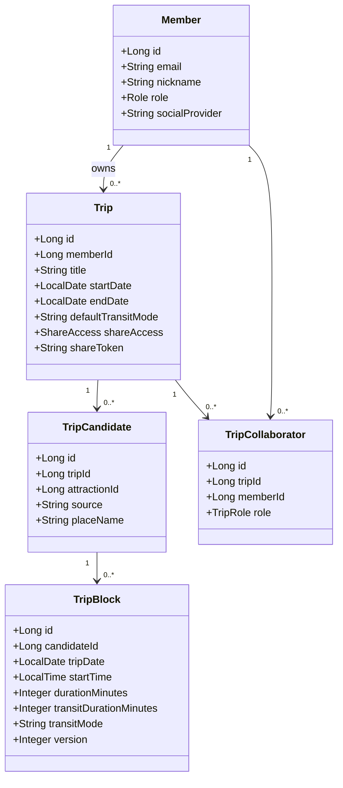
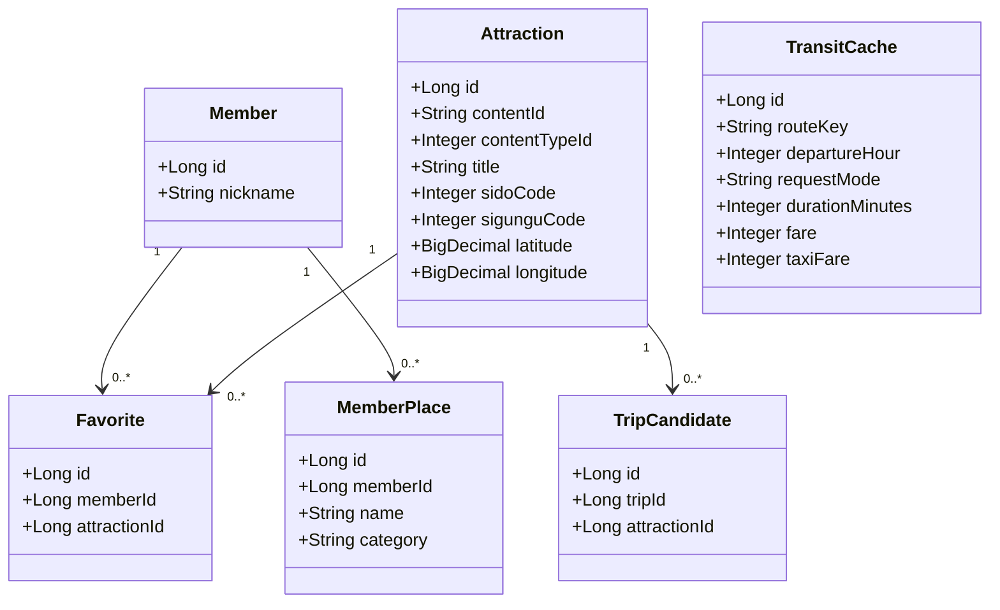
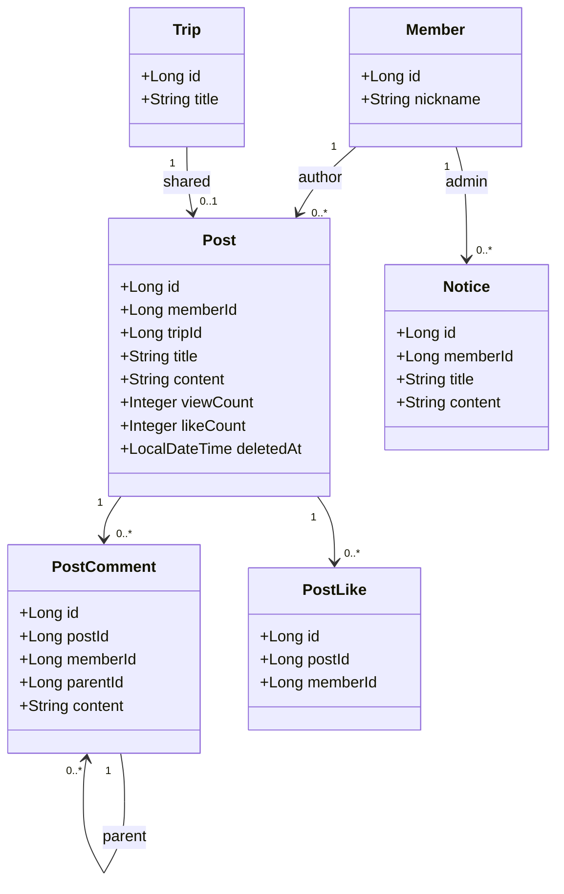

# 클래스 다이어그램 (백엔드)

> 도메인 중심 패키지 구조(member · attraction · plan · community · place · chat · global).
> 계층: **Controller → Service(Impl) → Mapper(MyBatis) → DB**, 외부 연동은 **Client** 클래스로 분리.

---

## 1. 계층형 아키텍처 (대표 도메인)

> Controller → Service → Mapper/Client 계층을 도메인 그룹별로 나눠 표기한다.

### 1-1. 회원 · 관광지 · 챗봇 · 장소

### 1-2. 여행 일정 · 이동 · 커뮤니티

---

## 2. 도메인 모델 (엔티티 관계)

### 2-1. 회원 · 여행 일정

### 2-2. 관광지 · 이동 · 개인 장소

### 2-3. 커뮤니티

---

## 3. 패키지·책임 요약

| 패키지 | Controller | Service | 주요 Client/Config |
|--------|-----------|---------|-------------------|
| `member` | AuthController, MemberController | AuthService, MemberService, MemberMapService | (Kakao OAuth) |
| `attraction` | AttractionController, AttractionSyncController | AttractionService | TourApiClient, TourApiSyncJobConfig, TourApiCallLimiter |
| `chat` | AttractionChatController | AttractionChatService | ChatClientConfig (Spring AI / gms) |
| `plan` | TripController, TransitController, TripPresenceController | TripService, TransitService | OdsayClient, TMapClient |
| `community` | PostController, CommentController, LikeController, BookmarkController, NoticeController | PostService, CommentService, LikeService, BookmarkService | PostImageCleanupListener |
| `place` | MyPlaceController, PlaceController | MemberPlaceService, PlaceService | KakaoLocalClient |
| `global` | ImageController | FileStorageService, OrphanImageCleanupScheduler | SecurityConfig, WebSocketConfig, JwtTokenProvider, GlobalExceptionHandler, ApiResponse |

> 공통 응답은 `ApiResponse<T>`(`{success, data, message, errorCode}`)로 래핑. 인증은 `JwtAuthenticationFilter` + `JwtTokenProvider`, 실시간 협업은 `WebSocketConfig` + STOMP(`TripPresenceController`) 기반.
