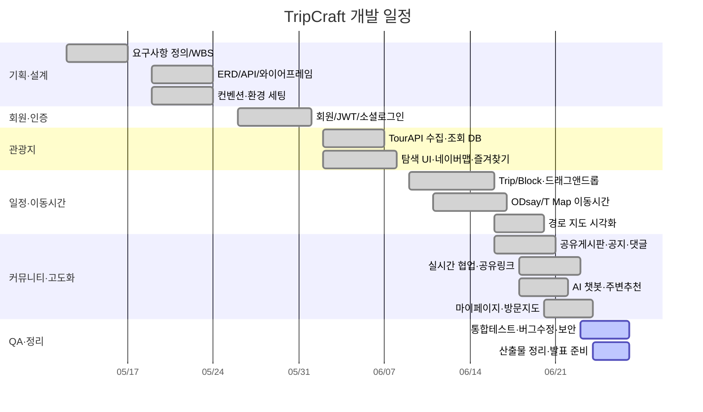

# TripCraft — 최종 완료 보고서

> **팀원**: 전진 · 송정기 · **작성일**: 2026.06
> **작성 포맷**: Markdown → `md-to-pdf`로 PDF 변환(기존 `build_v2.sh` 파이프라인과 동일). Mermaid·SVG 자동 렌더.
>
> 📌 **이 문서는 보고서 스캐폴드다.** 각 섹션의 `<!-- 작성지침 -->` 주석에 "무엇을·어디서 가져와" 쓸지 적어두었다.
> 기존 06_submission 문서를 **요약 + 링크**로 재사용하고, 세부는 부록/개별 문서로 민다. `🖊 placeholder`는 작업자가 직접 채운다.

---

## 목차

0. 표지
1. 기획 배경 · 목표
2. 추진 계획 (팀 전체 / 개인별 일정)
3. 시장 분석 (경쟁 비교 · 차별화 전략)
4. 개발 결과 (핵심 기술 · 구현 내용)
5. 개발 환경 & 전체 시스템 구조도
6. 화면 흐름도 및 시연
7. 적용 패턴 및 핵심 알고리즘
8. 기대 효과
9. 개발 후기 (팀 사진 · 개인별 회고)
- 부록 A. AI 사용 보고서
- 부록 B. API 명세 / ERD / 요구사항 정의서

---

## 0. 표지

<!-- 작성지침: 프로젝트명·슬로건·팀원·날짜·로고. slides_v2.md 표지 문구 재활용. -->

- **프로젝트명**: TripCraft — 여행을 설계하는 가장 스마트한 방법
- **팀원**: 전진 · 송정기
- **기간**: 2026.05 ~ 2026.06 (약 6주)

---

## 1. 기획 배경 · 목표

<!-- 작성지침: '여러 앱을 오가는 불편' 문제의식 → 통합 도구 목표. 추가(차별화) 기능 중심으로.
     재사용: 00_overview/project_proposal_v0.2.md, slides_v2.md §3, 01_requirements/요구사항정의서_v2.md 개요·핵심 플로우 -->

### 1-1. 문제 인식

국내 여행을 계획할 때 사용자는 **최소 4~5개의 서로 다른 서비스를 동시에** 열어두고 작업한다. 가고 싶은 관광지는 포털 지도로 검색하고, 운영 시간·예약은 개별 사이트에서 확인하며, 장소 간 이동 수단과 소요 시간은 대중교통 앱으로 따로 계산하고, 숙소는 예약 플랫폼에서 비교한다. 일행이 있다면 이 과정을 메신저·노션·공유 메모를 오가며 맞춰야 한다. 결국 "여행 계획을 세우는 일" 자체가 피로한 작업이 되고, 공들여 짠 일정도 현장에서 이동 시간이 어긋나면 전체 흐름이 무너진다.

### 1-2. 핵심 불편함

| 불편 | 내용 |
|------|------|
| **정보의 분산** | 관광지·이동·숙소 정보가 서로 다른 서비스에 흩어져 통합된 뷰가 없음 |
| **수동 이동 시간 계산** | 장소가 바뀔 때마다 이동 시간을 직접 검색해 수기로 반영 |
| **일정의 경직성** | 시간·장소를 옮겨도 동선을 자동 재배치·재계산해 주는 도구 부재 |
| **협업의 불편함** | 범용 도구는 여행 일정 특유의 시간·장소 구조를 표현하기 어렵고 실시간 논의에 부적합 |

### 1-3. 목표 — "한 화면에서 끝나는 여행 일정 도구"

TripCraft는 위 네 가지 불편을 하나의 작업실 안에서 해소한다. **관광지 탐색 → 후보군 등록 → 드래그앤드롭 일정 확정 → 구간 이동시간 자동 계산 → 커뮤니티 공유**를 끊김 없는 한 흐름으로 제공하고, 일행과는 실시간으로 함께 편집한다.

| 핵심 가치 | 설명 |
|------|------|
| **통합(Integration)** | 탐색–후보군–타임라인–공유를 한 플로우로 |
| **자동화(Automation)** | 장소 추가 시 도시 분류·이동시간·이동수단과 경로 연동이 자동 처리 |
| **유연성(Flexibility)** | 후보군을 먼저 모으고 날짜·시간은 나중에 정하는 2단계 계획 |
| **협업(Collaboration)** | 여행 일정 특화 UI로 일행과 실시간 공동 편집 |

### 1-4. 추가·차별화 기능

- **실시간 공동 편집**: WebSocket(STOMP) 기반 동시 편집 + 낙관적 락 동시성 제어 + 상대 커서 표시
- **멀티모달 이동시간**: ODsay(대중교통) + T Map(자동차·도보·택시요금)을 **구간별 모드 선택**으로, 경로를 지도에 폴리라인 시각화
- **관광지 AI 챗봇**: Spring AI 기반 컨텍스트 Q&A + 반경 3km 주변 추천
- **공유 링크 / 커뮤니티**: VIEW·EDIT 권한 공유 링크, 완성 일정의 게시판 공유, 방문 지도로 기록 자산화

### 1-5. 목표 사용자

국내 여행지를 직접 조사·설계하는 **자유여행 선호자**, 2인 이상이 함께 계획하는 **소그룹 여행자**, 그리고 촘촘한 일정보다 유연한 플로우를 선호하되 **기본 동선은 미리 잡아두고 싶은** 여행자.

🔗 출처: [`00_overview/project_proposal_v0.2.md`](../00_overview/project_proposal_v0.2.md), [`01_requirements/요구사항정의서_v2.md`](./01_requirements/요구사항정의서_v2.md), `ppt/slides_v2.md` §1

---

## 2. 추진 계획 (팀 전체 / 개인별 일정)

<!-- 작성지침: 6주 단계·마일스톤·개인 분담·리스크 대응. WBS_간트_v2.md 의 Mermaid gantt + 분담표 그대로 인용.
     인터랙티브 간트는 gantt.html 링크. -->

**기준 일정**: 약 6주 · **개발 인원**: 2인 (전진 · 송정기)

### 2-1. 전체 일정 요약

| 단계 | 기간 | 주요 내용 |
|------|------|-----------|
| 1단계 — 기획 | Week 1 | 요구사항 정의, WBS, 협업 환경 세팅 |
| 2단계 — 설계 | Week 2 | ERD, API 명세, UI 와이어프레임, 코딩 컨벤션 |
| 3단계 — 개발 | Week 3~5 | 회원 → 관광지·즐겨찾기 → 일정·이동시간 |
| 4단계 — 커뮤니티·고도화 | Week 6~ | 공유게시판·공지, 실시간 협업·공유링크, AI 챗봇, 마이페이지 |
| 5단계 — QA·정리 | 막바지 | 통합 테스트, 버그 수정, 보안 점검, 산출물 정리 |

### 2-2. 간트 차트

### 2-3. 마일스톤

| 마일스톤 | 목표 | 완료 기준 | 상태 |
|----------|------|-----------|------|
| M1 — 설계 완료 | Week 2 | ERD·API·와이어프레임 확정 | ✅ |
| M2 — 회원+관광지 | Week 4 | 로그인·관광지 조회·즐겨찾기 동작 | ✅ |
| M3 — 일정 기능 | Week 5 | 드래그 타임라인·이동시간·저장 동작 | ✅ |
| M4 — MVP+고도화 | Week 6 | 커뮤니티·협업·AI 챗봇·마이페이지 동작 | ✅ |
| M5 — 제출 | 막바지 | QA·산출물·발표 준비 완료 | 🔄 |

### 2-4. 개인별 일정 (도메인 분담)

> 2인 페어가 도메인을 나누어 병렬 진행하고, 핵심 화면(일정 편집)·협업 기능은 공동 작업했다.

| 주차 | 전진 | 송정기 |
|------|------|--------|
| W1~2 | 요구사항·유스케이스, API 명세 | ERD·스키마, 컨벤션·환경 세팅 |
| W3 | 회원·JWT·Spring Security | 관광지 TourAPI 수집·조회 |
| W4 | 커뮤니티 게시판  | 후보군 자동연동 · 관광지 탐색 UI · 네이버맵 |
| W5 | 마이페이지·일정 드래그 앤 드롭  | 타임라인 · 이동시간(ODsay/T Map) · 경로 시각화 |
| W6~ | 실시간 협업 | 공유링크·AI 챗봇 | 

### 2-5. 리스크 & 대응

| 리스크 | 대응 |
|--------|------|
| TourAPI 할당량 초과 | 초기 일괄 적재 후 자체 DB 서비스, call limiter |
| ODsay/T Map 응답 지연·쿼터 | 좌표 기반 모드별 캐시 + 노선 폴리라인 영구 캐시 |
| 드래그앤드롭 구현 복잡도 | vuedraggable 활용 |
| 실시간 협업 동시 편집 충돌 | `version` 낙관적 락으로 후행 저장 거부·재동기화 |
| 2인 일정 지연 | 주 1회 동기화, 우선순위 재조정 |

🔗 상세·인터랙티브 간트: [`03_wbs/WBS_간트_v2.md`](./03_wbs/WBS_간트_v2.md), [`03_wbs/gantt.html`](./03_wbs/gantt.html)

---

## 3. 시장 분석 (경쟁 비교 · 차별화 전략)

<!-- 작성지침: 네이버 여행/구글 지도/트리플 등과 비교표 + TripCraft 차별점(자동 이동시간·실시간 협업·AI).
     slides_v2.md §5 표를 확장. 필요 시 경쟁 서비스 1~2개 캡처 추가(🖊 placeholder). -->

### 3-1. 경쟁 서비스 비교

기존 서비스는 "장소 탐색"이나 "길찾기"는 잘하지만, **여러 장소를 하루 단위 동선으로 엮고 구간 이동시간을 자동 반영하며 일행과 함께 편집**하는 흐름은 비어 있다. TripCraft는 이 공백을 정조준한다.

| 항목 | 네이버 여행 | 구글 지도 | 트리플 | **TripCraft** |
|------|:---:|:---:|:---:|:---:|
| 관광지 탐색 | ◯ | ◯ | ◯ | ◯ |
| 드래그앤드롭 일정 | △ | ✕ | △ | **◎** |
| 구간 이동시간 자동 | ✕ | ◯ | △ | **◎** |
| 이동수단 구간별 선택 | ✕ | △ | ✕ | **◎** |
| 실시간 공동 편집 | ✕ | ✕ | ✕ | **◎** |
| AI 관광 챗봇 | ✕ | ✕ | △ | **◎** |
| 일정 커뮤니티 공유 | △ | ✕ | ◯ | **◯** |

> ◎ 강점 · ◯ 지원 · △ 부분 · ✕ 미지원

핵심 공백은 **드래그앤드롭 일정 + 구간별 이동수단 선택 + 실시간 공동 편집** 세 축으로, 어느 경쟁 서비스도 동시에 제공하지 않는다.

### 3-2. 차별화 전략

- **통합 동선 설계**: 탐색–후보군–타임라인을 한 화면(작업실)에서 끊김 없이 이어 붙여, 서비스 간 전환 비용을 제거한다.
- **현실적 이동시간**: ODsay(대중교통) + T Map(자동차·도보·택시요금)을 **구간별 모드 선택**으로 반영해, 일정이 실제 동선과 맞물리게 한다.
- **협업 우선**: 공유 링크(VIEW/EDIT) + 실시간 동시 편집(낙관적 락·상대 커서) — 경쟁 서비스가 제공하지 않는 영역을 핵심 차별점으로 삼는다.
- **AI 도우미**: 관광지 컨텍스트 Q&A + 반경 3km 주변 추천으로 탐색–결정 사이의 정보 탐색 비용을 낮춘다.
- **기록의 자산화**: 완성한 여행을 커뮤니티 공유와 방문 지도로 시각화해 재방문·재사용 가능한 기록으로 남긴다.

🔗 출처: `ppt/slides_v2.md` §3 (시장 분석)
🖊 placeholder: 경쟁 서비스 화면 캡처(선택)

---

## 4. 개발 환경 & 전체 시스템 구조도

<!-- 작성지침: 기술 스택표 + Mermaid 시스템 구조도(클라이언트/서버/DB/외부 API). 배포 구성(nginx·docker) 한 줄.
     재사용: 기타참고문서_v2.md §1(스택)·§2(구조도 Mermaid) 그대로 -->

🔗 재사용(거의 그대로): [`05_reference/기타참고문서_v2.md`](./05_reference/기타참고문서_v2.md) §1·§2

---

## 5. 화면 흐름도 및 시연

<!-- 작성지침: 화면 흐름도(Mermaid) + 핵심 5화면 와이어프레임 + 시연 순서. 실제 시연 스크린샷은 작업자 추가.
     재사용: 화면설계서_v2.md §2(흐름도)·§6(와이어프레임), 시연시나리오.md -->

🔗 재사용: [`04_screen/화면설계서_v2.md`](./04_screen/화면설계서_v2.md) §2·§6, [`05_reference/시연시나리오.md`](./05_reference/시연시나리오.md)
🖼 와이어프레임: `04_screen/wireframes/screen-M/A/B/C/D.svg`
🖊 placeholder: 실제 시연 스크린샷/영상 캡처

---
## 6. 개발 결과 (핵심 기술 · 구현 내용)

<!-- 작성지침: 도메인별 구현 성과 요약(회원/관광지/일정/이동시간/협업/커뮤니티/AI). 표로 간결히.
     세부 기술은 §7과 부록으로 미루고 여기선 '무엇을 만들었나' 위주.
     재사용: 기타참고문서_v2.md §5, API명세.md, 기술심화-*.md 2종 -->

🔗 재사용: [`05_reference/기타참고문서_v2.md`](./05_reference/기타참고문서_v2.md), [`05_reference/API명세.md`](./05_reference/API명세.md)

---

## 7. 적용 패턴 및 핵심 알고리즘

<!-- 작성지침: ① 이동시간 캐싱(좌표 route_key·모드별·정밀도) ② 드래그 타임라인(TRIGGER·30분 스냅)
     ③ 실시간 협업(낙관적 락+grab+afterCommit) ④ AI 주변추천 ⑤ 데이터 보존(SET NULL/RESTRICT/소프트딜리트).
     재사용: 기타참고문서_v2.md §5, 기술심화 2종, 03_dev 원문 -->

🔗 재사용: [`05_reference/기타참고문서_v2.md`](./05_reference/기타참고문서_v2.md) §5,
[`05_reference/기술심화-경로최적화및지도시각화.md`](./05_reference/기술심화-경로최적화및지도시각화.md),
[`05_reference/기술심화-실시간협업및동시성.md`](./05_reference/기술심화-실시간협업및동시성.md),
원문 `docs/03_dev/collab_concurrency_decision.md` · `transit_external_api.md`

---

## 8. 기대 효과

<!-- 작성지침: 계획 시간 단축·일정 현실성(이동시간 반영)·협업 생산성·여행 기록 축적·확장성. 불릿 5개 내외.
     재사용: slides_v2.md §11 -->

🔗 출처: `ppt/slides_v2.md` §11

---

## 9. 개발 후기 (팀 사진 · 개인별 회고)

<!-- 작성지침: 작업자 직접 작성. 팀 사진 + 전진/송정기 각자 회고(배운 점·어려웠던 점·다음에 시도할 것). -->

🖊 placeholder (작업자 직접):
- 팀 사진
- 전진 회고:
- 송정기 회고:

---

## 부록 A. AI 사용 보고서

🔗 [`ai-report/AI사용보고서.md`](./ai-report/AI사용보고서.md)

## 부록 B. 설계 산출물

- 요구사항 정의서: [`01_requirements/요구사항정의서_v2.md`](./01_requirements/요구사항정의서_v2.md)
- Use-Case: [`02_diagrams/usecase.md`](./02_diagrams/usecase.md) (+ `usecase.svg`)
- 클래스 다이어그램: [`02_diagrams/class-diagram.md`](./02_diagrams/class-diagram.md)
- ER 다이어그램: [`02_diagrams/er-diagram.md`](./02_diagrams/er-diagram.md) (+ `er-diagram.dbml`)
- API 명세: [`05_reference/API명세.md`](./05_reference/API명세.md)
- DB 스키마(정본): `docs/02_design/schema.sql`
