# ER 다이어그램 — TripCraft

> **기준**: `docs/sql/schema.sql` (v0.5) · MySQL 8.0
> 총 17개 도메인 테이블 + 참조/설정 테이블. 모든 FK의 삭제 정책(CASCADE / SET NULL / RESTRICT)을 관계 라벨에 표기.

---

## 1. 전체 ERD (Mermaid)

```mermaid
erDiagram
    MEMBER ||--o{ MEMBER_TOKEN : "CASCADE"
    MEMBER ||--o{ FAVORITE : "CASCADE"
    MEMBER ||--o{ TRIP : "CASCADE"
    MEMBER ||--o{ MEMBER_PLACE : "CASCADE"
    MEMBER ||--o{ TRIP_COLLABORATOR : "CASCADE"
    MEMBER ||--o{ POST : "SET NULL"
    MEMBER ||--o{ POST_LIKE : "CASCADE"
    MEMBER ||--o{ POST_COMMENT : "SET NULL"
    MEMBER ||--o{ NOTICE : "SET NULL"
    MEMBER ||--o{ POST_BOOKMARK : "CASCADE"
    MEMBER ||--o{ MEMBER_MAP_COVER : "CASCADE"

    SIDO ||--o{ SIGUNGU : "code"
    SIDO ||--o{ ATTRACTION : "code(논리)"

    ATTRACTION ||--o| ATTRACTION_DETAIL_COMMON : "CASCADE"
    ATTRACTION ||--o| ATTRACTION_DETAIL_INTRO : "CASCADE"
    ATTRACTION ||--o{ ATTRACTION_DETAIL_IMAGE : "CASCADE"
    ATTRACTION ||--o{ ATTRACTION_DETAIL_INFO : "CASCADE"
    ATTRACTION ||--o{ FAVORITE : "CASCADE"
    ATTRACTION ||--o{ TRIP_CANDIDATE : "CASCADE(nullable)"

    TRIP ||--o{ TRIP_CANDIDATE : "CASCADE"
    TRIP ||--o{ TRIP_COLLABORATOR : "CASCADE"
    TRIP ||--o{ POST : "SET NULL"

    TRIP_CANDIDATE ||--o{ TRIP_BLOCK : "RESTRICT"

    POST ||--o{ POST_LIKE : "CASCADE"
    POST ||--o{ POST_COMMENT : "CASCADE"
    POST ||--o{ POST_BOOKMARK : "no-cascade"
    POST ||--o{ MEMBER_MAP_COVER : "CASCADE"
    POST_COMMENT ||--o{ POST_COMMENT : "parent CASCADE"

    MEMBER {
        bigint id PK
        varchar email UK "소셜은 NULL 가능"
        varchar nickname "2~20자"
        varchar password "BCrypt, 소셜은 NULL"
        enum role "USER / ADMIN"
        varchar social_provider "kakao 등"
        varchar social_id
        timestamp created_at
        timestamp updated_at
    }
    MEMBER_TOKEN {
        bigint id PK
        bigint member_id FK
        varchar refresh_token
        datetime expires_at "+7일"
        timestamp created_at
    }
    SIDO {
        tinyint sido_code PK "1=서울 … 39=제주"
        varchar name "공식명"
        varchar alias "표시명"
    }
    SIGUNGU {
        tinyint sido_code PK
        tinyint sigungu_code PK
        varchar name
        varchar alias
    }
    ATTRACTION {
        bigint id PK
        varchar content_id UK "TourAPI contentid"
        tinyint content_type_id "12/14/28/32/38/39"
        varchar title
        tinyint sido_code
        tinyint sigungu_code
        decimal latitude
        decimal longitude
        varchar first_image
        datetime api_modified_at "증분 동기화 기준"
        timestamp synced_at
    }
    ATTRACTION_DETAIL_COMMON {
        varchar content_id PK "FK->attraction"
        text overview
        varchar homepage
        varchar telname
    }
    ATTRACTION_DETAIL_INTRO {
        varchar content_id PK "FK->attraction"
        tinyint content_type_id
        json intro_data "유형별 소개 전체"
    }
    ATTRACTION_DETAIL_IMAGE {
        bigint id PK
        varchar content_id FK
        varchar originimgurl
        varchar smallimageurl
    }
    ATTRACTION_DETAIL_INFO {
        bigint id PK
        varchar content_id FK
        varchar infoname
        text infotext
        json room_data "숙박 객실정보"
    }
    FAVORITE {
        bigint id PK
        bigint member_id FK
        bigint attraction_id FK
        timestamp created_at
    }
    TRIP {
        bigint id PK
        bigint member_id FK "소유자"
        varchar title "최대 30자"
        date start_date
        date end_date
        tinyint member_count
        varchar default_transit_mode "기본 이동수단"
        tinyint is_public
        enum share_access "PRIVATE/VIEW/EDIT"
        char share_token UK "URL-safe 토큰"
    }
    TRIP_CANDIDATE {
        bigint id PK
        bigint trip_id FK
        bigint attraction_id FK "커스텀이면 NULL"
        tinyint city_code
        enum source "MANUAL/FAVORITE/CUSTOM"
        varchar place_name "커스텀 장소"
        decimal place_lat
        decimal place_lng
    }
    MEMBER_PLACE {
        bigint id PK
        bigint member_id FK
        varchar name
        varchar category
        decimal latitude
        decimal longitude
    }
    TRIP_COLLABORATOR {
        bigint id PK
        bigint trip_id FK
        bigint member_id FK
        enum role "EDITOR/VIEWER"
        timestamp invited_at
    }
    TRIP_BLOCK {
        bigint id PK
        bigint candidate_id FK
        date trip_date "여행기간 내(TRIGGER 검증)"
        tinyint display_order
        time start_time
        smallint duration_minutes
        smallint transit_duration_minutes "이전블록→이블록"
        varchar transit_mode
        int transit_option_index
        int version "낙관적 락"
    }
    TRANSIT_CACHE {
        bigint id PK
        varchar route_key UK "좌표 기반 키"
        tinyint departure_hour
        varchar request_mode "PUBLIC_TRANSIT/DRIVING/WALKING"
        smallint duration_minutes
        int fare
        int taxi_fare "T Map"
        json path_detail "ODsay subPath"
        mediumtext route_coords "T Map GeoJSON"
    }
    LANE_POLYLINE {
        bigint id PK
        varchar map_object_key UK "ODsay info.mapObj"
        mediumtext route_coords
        mediumtext raw_response
    }
    SYSTEM_CONFIG {
        varchar config_key PK
        varchar config_value
        varchar description
    }
    POST {
        bigint id PK
        bigint member_id FK "탈퇴 시 NULL"
        bigint trip_id FK "일정 삭제 시 NULL"
        varchar title
        text content
        int view_count
        int like_count "집계 캐시"
        datetime deleted_at "소프트 딜리트"
    }
    POST_LIKE {
        bigint id PK
        bigint post_id FK
        bigint member_id FK
        timestamp created_at
    }
    POST_COMMENT {
        bigint id PK
        bigint post_id FK
        bigint member_id FK "탈퇴 시 NULL"
        bigint parent_id FK "대댓글 1단계"
        varchar content "최대 1000자"
    }
    POST_BOOKMARK {
        bigint member_id PK "FK->member"
        bigint post_id PK "FK->post, no-cascade"
        datetime created_at
    }
    NOTICE {
        bigint id PK
        bigint member_id FK "관리자, 삭제 시 NULL"
        varchar title
        text content
    }
    ATTACH {
        bigint id PK
        varchar name "UUID.ext"
        varchar host_path
        varchar target "profile/post/post_draft"
        bigint target_id
    }
    MEMBER_MAP_COVER {
        bigint member_id PK "FK->member"
        varchar region_level PK "SIDO/SIGUNGU"
        smallint region_code PK
        bigint post_id FK "표지 글"
    }
```



> **참고**: Mermaid 표기상 모든 컬럼을 싣지 않고 핵심 컬럼만 발췌했다. 전체 DDL·인덱스·트리거·시드 데이터는 `docs/sql/schema.sql`(정본)을 참조한다.

---

## 2. 핵심 설계 결정 (FK 삭제 정책)

| 테이블 | 정책 | 의도 |
|--------|------|------|
| `member` | **하드 딜리트** | 탈퇴 시 앱 레이어가 `trip_block → trip_candidate → trip` 순으로 정리 후 회원 삭제 |
| `member_token`, `favorite`, `trip`, `member_place`, `trip_collaborator` | `ON DELETE CASCADE` | 회원 종속 데이터는 함께 제거 |
| `post`, `notice` (member_id) | `ON DELETE SET NULL` | 작성자 탈퇴해도 글·공지 보존 → "탈퇴한 사용자" 표시 |
| `post` (trip_id) | `ON DELETE SET NULL` | 공유 일정 삭제돼도 게시글 본문 보존 |
| `trip_block` → `trip_candidate` | `ON DELETE RESTRICT` | 후보군 삭제 전 "타임라인 블록도 삭제" 모달 확인 UX 보장 |
| `post_comment` (parent_id) | `ON DELETE CASCADE` | 부모 댓글 삭제 시 대댓글 동반 삭제 (1단계) |
| `post_bookmark` (post_id) | **CASCADE 없음** | 글이 소프트 딜리트돼도 북마크 레코드 보존 → "삭제된 글입니다" 표시 |
| `attraction_detail_*` | `ON DELETE CASCADE` (content_id) | 관광지 재동기화/삭제 시 상세 동반 정리 |

## 3. 비정규화·캐시 전략

- **`trip_block.transit_duration_minutes / transit_mode`**: 이동 시간을 블록에 비정규화 저장 — 매 조회 시 외부 API 재호출 방지.
- **`post.like_count`**: `post_like` 집계를 캐시 컬럼으로 유지 — 목록 조회 시 COUNT 회피.
- **`transit_cache`**: `(좌표 route_key, departure_hour, request_mode)` 키로 ODsay·T Map 응답 캐시. 모드별 독립 캐시(UNIQUE).
- **`lane_polyline`**: ODsay 노선 형상은 거의 안 바뀌므로 `map_object_key` 단위 영구 캐시.
- **`attraction`**: TourAPI `api_modified_at` 기준 증분 배치 동기화. 상세(`detail_*`)는 지연 적재.
```
